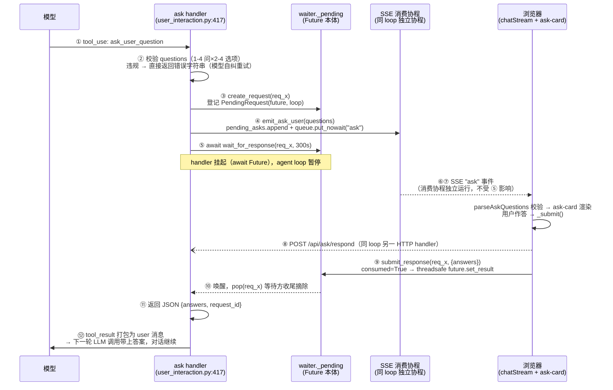
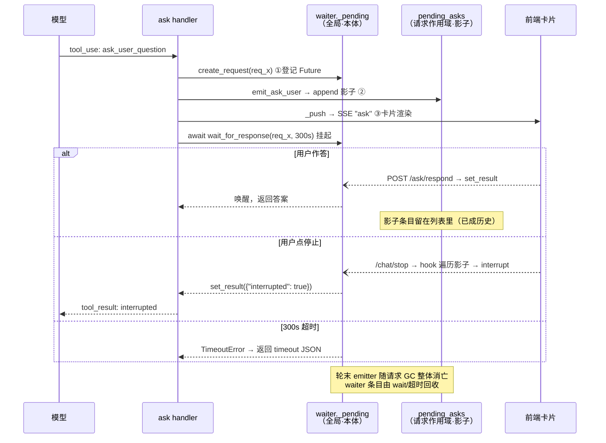

# ask 双向回环详解（SSE 单向的补丁）

> 生成日期：2026-08-31 · 2026-09-01 随全 async 化改造更新（`0ebb0853` 之后）
> 覆盖文件：`planify/tools/user_interaction.py`、`planify/streaming/waiter.py`、`doclens/web_v2/api/ask.py`、`doclens/web_v2/api/chat.py`、`doclens/web_v2/api/_chat_emitter.py`、`frontend/src/api/ask.ts`、`frontend/src/views/chat-view.ts`、`frontend/src/components/ask-card.ts`

## 一、要解决的问题

SSE 是纯单向流（服务端→客户端），而 `ask_user_question` 是**模型主动向用户提问并阻塞等待答案**的工具——存在反向数据流。Web 模式的方案是：正向问题搭 SSE 顺风车，反向答案走独立 HTTP 端点，两条通道在进程内的 `GlobalResponseWaiter` 单例汇合。

## 二、参与者清单

| 层 | 组件 | 职责 |
|---|---|---|
| planify 工具层 | `handle_ask_user_question`（`planify/tools/user_interaction.py:417`） | 校验入参、登记等待、发事件、**挂起**、包装答案为 tool_result |
| 等待器 | `GlobalResponseWaiter`（`planify/streaming/waiter.py:32`） | 进程级字典：request_id → `PendingRequest(future, loop, consumed)` |
| SSE 正向 | `ChatEventEmitter.pending_asks` + 直推 | 积累悬置问题 + emit 即入队为 SSE `ask` 事件 |
| Web 反向 | `POST /api/ask/respond`（`doclens/web_v2/api/ask.py:25`） | 接收答案，调 `waiter.submit_response` |
| 前端 | `chat-view.ts:426` + `ask-card.ts` | 解析问题、渲染交互卡片、提交答案 |

## 三、完整时序

全 async 化后全部参与者跑在**同一个 ASGI 主 loop** 上（无生成线程、无轮询）：



关键点：⑤挂起的只是 ask handler 协程本身——SSE 消费协程是**独立协程**，④的 ask 事件已经（或即将）被它取走；⑧的 respond 是同一 loop 上的另一个 HTTP handler，与挂起的 handler 互不阻塞。挂起不堵运输、不堵应答。

## 四、逐环节细节

### 1. 发起侧（`user_interaction.py:417-480`）

- **入参校验前置**（`:429-435`）：`validate_ask_questions` 不通过就直接返回错误字符串作为 tool_result——模型看到错误描述可自行修正参数重试，不占用等待通道。
- **request_id 生成**：`req_` + uuid 前 8 位（`:437`），由 handler 侧生成而非前端，保证两端持有同一个 id。
- **复用旧协议**（`:440-447`）：`ask_user_question` 不新增 EventEmitter 方法，蹭 `emit_ask_user` 通道——`input_type="questions"` 作判别标记，`question` 字段装 JSON 序列化的 questions 数组。`ChatEventEmitter.emit_ask_user` 只认这个类型收进 `pending_asks` 并直推 SSE（`_chat_emitter.py:188-199`），旧形态到达只记告警不吞细节（`:201`）。
- **挂起**（`:455-457`）：`await waiter.wait_for_response(request_id, timeout=300.0)`（`ASK_TIMEOUT_SECONDS`，`:26`）。

### 2. 正向运输（SSE ask 事件）

单 loop 直推：`emit_ask_user` 内 `pending_asks.append`（积累）+ `_push → queue.put_nowait`（运输，`_chat_emitter.py:193-198`）同一次调用完成 → SSE 消费协程被 `future.set_result` 唤醒 → `event_stream` 转 SSE 命名事件 `ask`（`chat.py:298-308`）。无轮询、无跨线程调度。

### 2.5 pending_asks：全局状态的请求作用域投影

`pending_asks` 不是一套独立机制，就是 emit_ask_user 里的一个 append + 三处读者。"pending" 状态的真相是三件事同时成立：

```
① waiter._pending 字典里有条目      ← 真正的"挂起"本体（Future 在等 set_result）
② emitter.pending_asks 列表里有快照  ← ①的镜像记录（request_id + questions JSON）
③ SSE "ask" 事件已推给前端          ← 用户侧的可见性
```

**①是本体，②是影子**——list 本身无状态机、无清理、append-only。它存在的核心价值：**waiter 是跨会话的全局单例，pending_asks 挂在每请求新建的 emitter 上，天然会话作用域**——中断 hook（`chat.py:100-105`）遍历它即可唤醒"本会话"挂起的 ask，无需反向索引全局字典。



两个设计细节：

- **影子从不清除**：答案到达后条目不删除，随 emitter 实例轮末整体 GC；
- **无害的不对称**：影子里可能含已答完的条目——中断 hook 粗放遍历会对它们调 `waiter.interrupt()`，但本体已 pop，interrupt 返回 False no-op。一致性责任全部交给唯一本体（waiter），影子可以简单到不做任何维护。

### 3. 前端（`chat-view.ts:426` + `ask-card.ts`）

- **双端校验**：后端 handler 校验过一次，前端 `parseAskQuestions`（`ask.ts:40`）再校验一遍（questions 数组、每问 question/header/options≥2）——解析失败直接作废事件，不渲染残缺卡片。
- **卡片状态机**（`ask-card.ts:170`）：`pending → answered | expired`。`willUpdate` 在新问题时重置内部状态（`:174-181`）。
- **提交门槛**：`_canSubmit` 要求每问至少一个选择（选项或 Other 文本，`:189-198`）。
- **提交**（`_submit`，`:220-248`）：组 `AskAnswer[]`（question / selected / other）→ `respondAsk` POST，带 **10s 超时**（`ask.ts:11`）把「永久提交中」变成明确报错；`_submitting` 标志防重复点击，`done` 标志保证 `ask-done` 事件只派发一次（`:243-247` 注释明确防 catch/finally 重入）。
- **提交结果三分支**：`submitted=true` → answered；`submitted=false`（request_id 已失效）→ expired；网络异常 → 同样 expired。三种情况卡片都定格、派 `ask-done` 冒泡事件让视图清理 `_activeAsk`。

### 4. 反向端点（`ask.py:25-57`）

三条明确的设计决策写在模块 docstring（`:7-12`）：

1. **request_id 即能力凭证**：uuid 截断、一次性、全局唯一，不做 session 强校验——追加校验无安全增益；
2. **不存在即失效**：查不到 id 说明已超时/已答，返回 `{ok:false, submitted:false}`，前端据此置卡片失效态；
3. **答案不过滤**：selected 里的未知 label、other 自由文本原样回传——静默过滤会丢用户真实意图，模型需要完整信息。

### 5. 唤醒机制——Future + 属主 loop threadsafe resolve（改造后）

`submit_response` 保持**同步签名**（`waiter.py:135`，CLI 输入线程仍可直接调），但内部两步走：

1. `consumed = True` 标记互斥（线程锁内，一次性消费，重复提交/中断后提交均 False）；
2. `pending.loop.call_soon_threadsafe(_resolve, pending, response)`——经属主 loop 调度 `future.set_result`，唤醒与传值一步完成。

改造前的隐患已消除：旧版跨线程直接 `asyncio.Event.set()` 靠 GIL 兜底（理论竞态，注释自述）；旧版"submit 先摘除条目"在 submit 早于 wait 开始时会让等待方 KeyError（实测暴露），`consumed` 标记 + 等待方醒来后摘除的新设计修复了这一竞态。

Web 路径下回环两侧（ask handler 与 respond 端点）同在 ASGI 主 loop，`call_soon_threadsafe` 等价于排队执行，行为一致且安全。

### 6. 一次性消费与超时回收

- **consumed 互斥**：submit / interrupt / cancel 三者先标记者生效（`waiter.py:155/177/203`）；条目由等待方醒来后 `pop` 收尾（不提前摘除，防 submit-早于-wait 竞态）；
- **中断唤醒**：`interrupt(request_id)` 摘除并 resolve `{"interrupted": True}`（`:161-179`），ask handler 醒来返回 `{"error": "interrupted"}` 给模型；
- **超时三重回收**：
  - handler 侧 300s 超时 → 返回 `{"error":"timeout", "request_id"}` 给模型（`user_interaction.py`），同时 waiter 清理 pending；
  - `cleanup_expired(max_age=600)` 兜底清扫，且会 resolve `{"error": "expired"}` 让等待方立刻拿到结果（不再干等超时）；
  - 前端 10s respond 超时只管 HTTP 请求本身，不影响后端等待。

## 五、边界情况与缺口

| 场景 | 行为 | 评估 |
|---|---|---|
| ~~挂起期间用户点「停止」~~ | ~~中断检查点覆盖不到工具挂起期~~ | ✅ **已修复**（全 async 化）：`chat_interrupt` 中断 hook 注册表 + `waiter.interrupt`——`request_stop` 时遍历本会话 `pending_asks` 唤醒挂起的 ask，秒级退出（见 2.5 节时序图「用户点停止」分支） |
| ~~跨线程 `event.set()`~~ | ~~GIL 兜底的理论竞态~~ | ✅ **已修复**（waiter Future 化）：`call_soon_threadsafe` resolve + `consumed` 一次性标记（见 4.5 节） |
| **页面刷新** | `pendingAsk` 是前端内存态，刷新后卡片消失、request_id 丢失，用户无法作答 | 靠 300s 超时自然回收；历史回看时 `resolvedAnswers` 预填 answered 态（`ask-card.ts:166`） |
| **用户不想回答** | 卡片没有「跳过/取消」按钮，`_canSubmit` 强制每问至少一个选择 | UX 缺口：只能干等超时，或选一个并非本意的选项（现在可点「停止」触发 interrupt 提前结束，但会终止整轮生成而非仅跳过问题） |
| **模型同轮连发两个 ask** | 工具顺序执行，第二个 ask 在第一个答完后才登记 | 安全，但同时只有一个悬置也是**能力上限**（无法并行提问） |

## 六、一句话总结

这是一个用「全局字典 + 属主 loop Future + 一次性 request_id」实现的进程内 RPC——SSE 负责把问题送出去，一个普通 POST 负责把答案带回来，waiter（本体）是两者的会合点、`pending_asks`（影子）是它会话作用域的投影；协议靠 request_id 的唯一性与一次性（consumed 互斥）保证安全。
