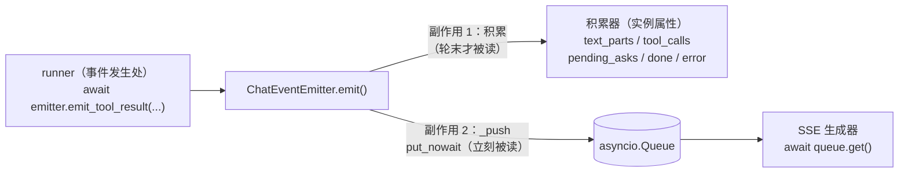
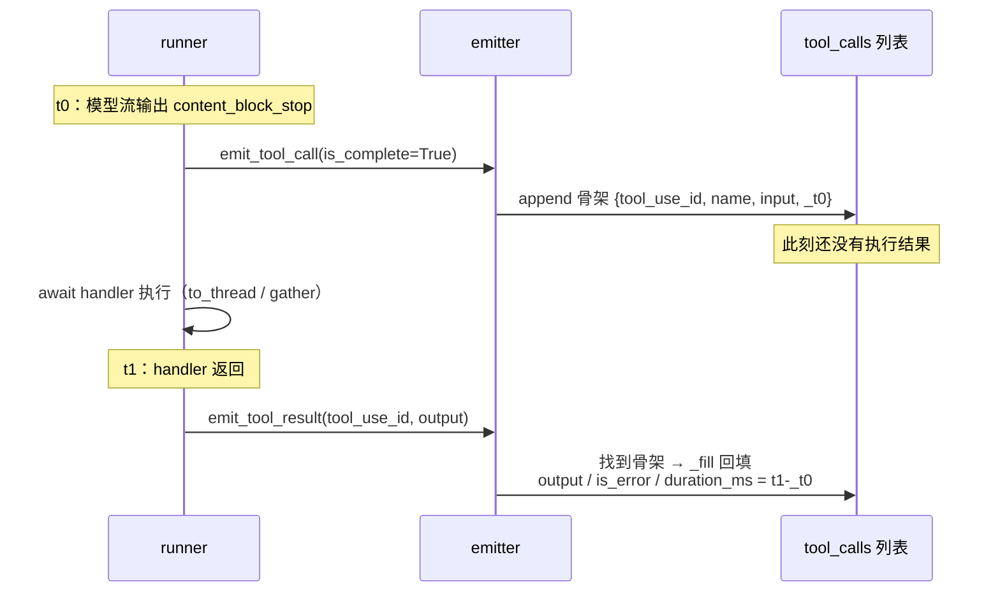
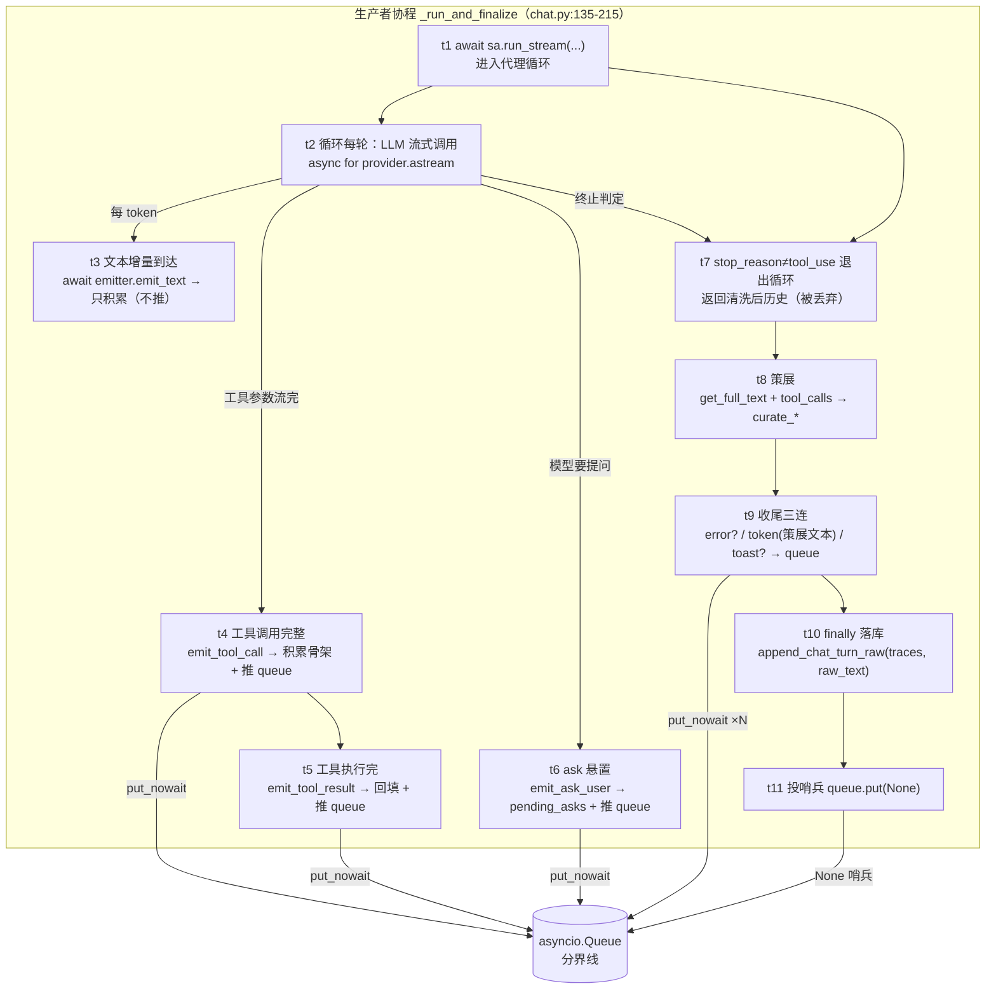
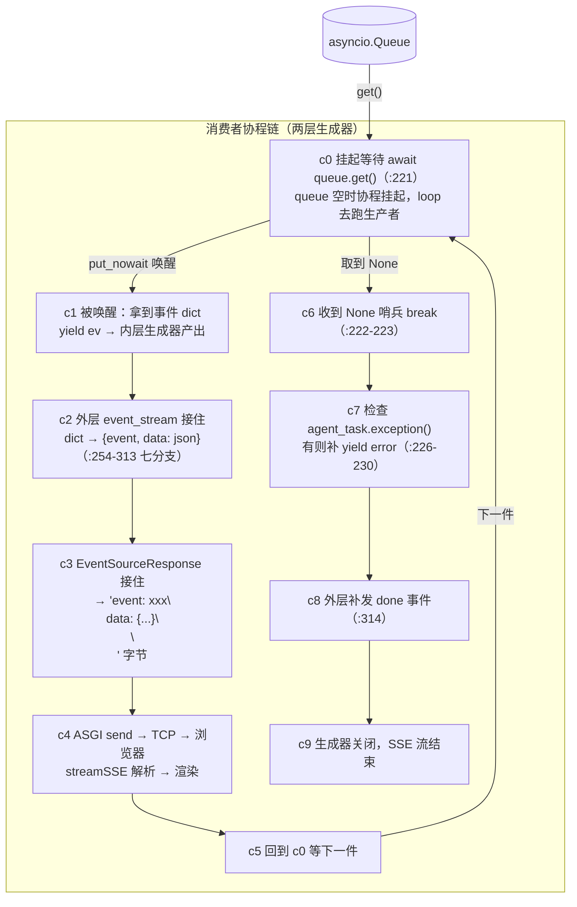
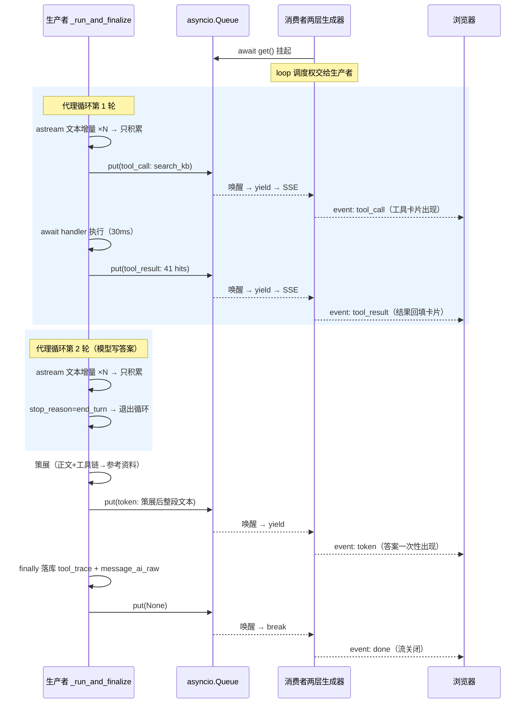

# 事件流详解：emitter 积累器与 SSE queue

> 生成日期：2026-09-01 · 基于全 async 化改造后的代码（commit `0ebb0853` 之后）
> 覆盖文件：`doclens/web_v2/api/_chat_emitter.py`、`api/chat.py`、`planify/streaming/runner.py`
> 姊妹篇：[ARCHITECTURE-sse.md](./ARCHITECTURE-sse.md)（SSE 链路总览）、[ARCHITECTURE-ask-loopback.md](./ARCHITECTURE-ask-loopback.md)（ask 回环）

本文回答两个问题：

1. 代理循环里 `await emitter.emit_tool_call` / `emit_text` 的中间结果**存在哪里**；
2. 工具事件如何**实时**到达前端、正文为何**不实时**。

## 一、全景：一次 emit 的两个副作用

代理循环里每个值得记录的时刻，runner 都 `await emitter.emit_xxx(...)`。这个调用**同时喂两个消费者**：



同一次调用、同步顺序执行——先积累后入队，两者看到的必然一致。这是"一份逻辑两个视图"的最低成本实现：不需要快照机制，因为积累和运输共享同一个执行点。

**分工一句话：积累器是"轮末要什么"，queue 是"此刻要看什么"。**

## 二、先纠正前提：没有"后台"

```python
agent_task = asyncio.create_task(_run_and_finalize())   # chat.py:205
```

`create_task` 只是**把协程排入当前事件循环的待执行队列**——不是线程、不是进程。`_run_and_finalize`、它内部的 `run_stream`、更里面的 `emit_text`，与 SSE 消费循环（`await queue.get()`）跑在**同一个线程、同一个 loop** 上，靠协作式调度交替执行。

## 三、积累器：四个属性，三种消费时机

```python
self.text_parts: list[str] = []     # 正文增量片段
self.tool_calls:  list[dict] = []   # 调用记录（先骨架后回填）
self.pending_asks: list[dict] = []  # 悬置问题（request_id + questions JSON）
self.done: bool = False             # DONE 标志
self.error: Optional[str] = None    # ERROR 消息（同时置 done）
```

### 1. `text_parts`：只进不改的碎片流

每次 TEXT 事件 append 一个增量（`_chat_emitter.py:67`），`get_full_text()` 就是 `"".join()`（`:46`）。没有任何变换——策展需要**模型的原话**（引文路径校验、`[N]` 对齐都以原始文本为基准），落库的 `message_ai_raw` 同理。

注意它**不实时推 queue**——TEXT 分支没有 `_push`。这是刻意的：正文要在 done 后过策展重写再整体推，边流边推会导致前端先看到原始版再跳变成策展版。

### 2. `tool_calls`：两阶段生命周期（骨架 → 回填）

工具调用在时间上是**分离的两个事件**：



回填的**配对算法三级降级**（`_chat_emitter.py:99-118`）：

| 级 | 匹配键 | 适用 |
|---|---|---|
| 1 | `tool_use_id` 精确匹配 + 未回填（`"output" not in tc`） | 正常情况 |
| 2 | `name` 匹配 + 未回填 | 某些端点 tool_result 事件丢 id 时的兜底 |
| 3 | 都不中 → 孤儿记录（直接 append 完整 dict，`duration_ms=None`） | 保证结果永不丢失 |

三级都 `reversed()` 从后往前找——同轮并发同名工具时优先匹配最近的。`_t0` 用 `pop` 取出（回填后消失），duration 只能算一次。

**为什么用 `"output" not in tc` 当幂等标记**：input 可能是任意 dict（包括空），output 是 str——用"回填过没有"当标记，省一个字段。落库时 `if "output" in tc`（`chat.py:203`）复用同一判据过滤未完成调用（中断时骨架没等到结果的就被丢弃）。

**为什么配对逻辑放在积累器而不是 runner**：runner 的职责是"发生什么就 emit 什么"（它不知道谁消费）；配对是**展示视角的重组**（把两条时间线合成一行记录），属于消费侧关切。

### 3. 消费时机：全部在轮末

```
done 后 _run_and_finalize：
├── emitter.get_full_text()  → 策展输入（skill_refs / refs_curator）
│                             → 路径校验用 tool_calls 里的 input/output
├── emitter.error            → 转 SSE error 事件
├── traces = [tc for tc in emitter.tool_calls if "output" in tc]
│                             → append_chat_turn_raw 落库 tool_trace + message_ai_raw
└── （前端另写 message_ai 策展展示文本，与 raw 分离）
```

中途唯一读积累器的是中断 hook（`chat.py:102`）——`pending_asks` 里的 request_id 用来唤醒挂起的 ask。

## 四、queue：为什么存在 + 它保证什么

### 1. 为什么需要它

生产端（`_run_and_finalize`）和消费端（`event_stream` 生成器）是**两个并发协程**，速度天然不匹配（生产由 LLM/工具决定，消费由网络/渲染决定）——经典生产者-消费者解耦。`asyncio.Queue` 给了三样保证：

- **背压语义**：`await get()` 空时挂起协程（不忙等、不占线程），有事件即被唤醒；
- **FIFO 有序**：单 loop 内 `put_nowait` 与 `get` 顺序严格一致——事件到达前端的顺序 = emit 顺序 = 发生顺序（旧轮询架构靠 `delivered_*` 集合维护、现在**免费获得**的不变量）；
- **无界但生命周期短**：每请求一个新 queue（`chat.py:82`），随请求结束被 GC——最坏堆积 = 一轮对话的全部事件，无需上限。

### 2. `put_nowait` 为什么安全

单 loop 直推的核心前提：**emit 的调用方（runner 协程）与 queue 的属主（创建它的 `event_stream`）在同一个事件循环**。asyncio 单线程执行模型下，`emit` 这个同步函数体从积累到入队之间**不可能**插入其他协程——没有 await 点就没有切换点。所以 `_push` 用同步的 `put_nowait` 即可，不需要锁（对比：旧双 loop 时代必须 `call_soon_threadsafe`）。

也正因如此 `emit` 虽是 async 函数，函数体内没有一个 await——async 签名只是为了满足 planify 的 `EventEmitter` 协议（runner 侧统一 `await emitter.emit_xxx(...)`，CLI/TUI 的其他 emitter 实现可能是真异步）。

## 五、双视角看信息流：queue 是分界线

queue 左边的一切只在"轮内"有意义，右边的一切面向"网络那一头"。生产者往里放，消费者从里取——两端除 queue 外互不引用。

### 5.1 生产者视角："我每一步该通知谁"

生产者是 `_run_and_finalize`（`chat.py:135-215`），被 `create_task` 启动（`:217`），视角自始至终是"把 agent 循环的每个时刻变现成两类副作用"：



生产者的三个关键决策：

**决策 1：什么值得实时（t3 vs t4）**——对每个事件类型做路由分流：

| 事件 | 积累器 | queue | 理由 |
|---|---|---|---|
| 文本增量（t3） | ✅ `text_parts` | ❌ | 正文将被 t8 策展**重写**——直播原始版会跳变 |
| tool_call / tool_result（t4/t5） | ✅ | ✅ | 过程信息，永不重写，直播即最终版 |
| ask（t6） | ✅ | ✅ | 阻塞等待用户，必须立刻可见 |
| token 终版（t9） | ❌（不需再积累） | ✅ | 策展完成，一次性出 |

**决策 2：什么时候结束（t11）**——生产者最后一个动作是投 `None` 哨兵，且放在 finally。消费者唯一信赖的终止信号就是它——无论正常、内部错（emit_error 后 run_stream 平安返回）、被 cancel，哨兵必达。

**决策 3：被取消时保住什么（t10 也在 finally）**——被 cancel（断开）时 t8/t9 跳过（正文没人看了），但落库照跑：半截轮次的 tool_trace + raw 文本照样归档（`:204-206` 用 `"output" in tc` 过滤孤儿骨架）。直播可以中断，档案不能断。

### 5.2 消费者视角："我只认 queue，别的一概不知"

消费者是**两层生成器串联**：

```
event_stream 闭包 (chat.py:251)                              ← SSE 格式化层（外层）
  └── async for ... _stream_agent_response (chat.py:38)      ← 取件层（内层）
        └── await queue.get() (chat.py:221)                  ← 唯一的取件窗口
```



消费者的三个关键行为：

**行为 1：被动驱动**——整个生命周期是"挂起 → 被生产者的 `put_nowait` 经 `future.set_result` 唤醒 → 处理一件 → 再挂起"。不轮询、不询问生产者状态、不知道 agent 存在——queue 之外的任何对象都不引用。每件货的处理是纯函数式 dict 变换（c2 的 if/elif 链，7 种类型 → 7 种 SSE 事件）。

**行为 2：终态依赖哨兵而非推断（c6-c8）**——判断"结束"的唯一依据是 `None`。拿到哨兵后：问一句 `agent_task.exception()`（哨兵到了但生产者抛了未处理异常时补一条 error——消费者不替生产者隐瞒）；补发 `done`（给前端协议层的句号，无论前面发生了什么）。

**行为 3：自己先死时的善后（finally，`chat.py:231-246`）**——客户端断开 → ASGI 取消外层生成器 → CancelledError 沿两层生成器传播 → 内层 finally 执行：`unregister_interrupt` / `unregister_interrupt_hook`（摘登记防泄漏）；`if not agent_task.done()` → 三层兜底反向终止生产者（`request_stop` Event 检查点 + hook 唤醒挂起 ask + `agent_task.cancel()` 让 CancelledError 沿生产者 await 链烧过去）；`await agent_task`（收尸，吸收取消异常）。我死了不能留一个没人消费的生产者空烧 token。

### 5.3 两端合起来：一轮完整对话（1 次工具调用）



信息流总账（谁流向谁）：

```
LLM 网络流 ──astream──► 生产者 ──┬──积累──► emitter 快照 ──轮末──► SQLite（归档）
                                 │
                                 └──_push──► queue ──get──► 消费者 ──SSE──► 浏览器（直播）
                     反向控制流（断开）：浏览器断连 ──► CancelledError → request_stop/cancel → 生产者
```

- **正向**：两条并行通道（归档流 + 直播流），分叉点在 `emit`，汇合点只在下一轮的 `get_chat_history`（DB 重建上下文）；
- **反向**：只有一条，且只在异常路径（断开/停止）——消费者向上游传播取消，全链路唯一的逆向信息流；
- **同步机制**：`future.set_result` 即时唤醒（毫秒级）+ `None` 哨兵终止协议 + finally 双向兜底（生产者保落库、消费者保收尸）。

### 5.4 调度要点（为何"同步 put"能"实时唤醒"）

1. **`await` 的真实含义**：协程在 await 未就绪的 future 时挂起自己、控制权还给 loop；loop 去跑别的就绪协程（这里就是 SSE 消费端在 `await queue.get()` 上挂着）。
2. **`put_nowait` 唤醒等待者**：asyncio.Queue 内部维护 `_get_waiter` future。`put_nowait` 发现队列空且有等待者时，不走"入队再等消费者轮询"的路径，而是**直接 `future.set_result(事件)`**——消费者的挂起被解除。
3. **单 loop 无竞争**：runner 协程从 `_push` 返回到下一个 await 点之间是原子的（没有 await 就没有切换）。所以"入队"和"消费者恢复"之间绝无第三个协程插队——事件顺序铁定不乱。

## 六、"实时"的粒度对照

| 事件类型 | 到达前端的时机 | 路径 |
|---|---|---|
| `tool_call` / `tool_result` / `ask` | **毫秒级实时**（emit 即入队即唤醒） | `_push` 完整链路 |
| `token`（正文） | **不实时**——done 后策展完一次性推 | 只进 `text_parts`，绕过 queue |
| `done` / `error` / `toast` | 轮末收尾时 | `_run_and_finalize` 直接 `put_nowait` |

前端看直播时：工具调用的"思考过程"逐条刷出（每次工具执行完几百毫秒内可见），最终答案"啪"地一整段出现——两类延迟差异不是网络问题，是 `_push` 的选择性使用。

## 七、哨兵与终止协议

queue 的终止用 `None` 哨兵（`chat.py:203`），投放在 `_run_and_finalize` 的 **finally**——无论 agent 正常结束、内部出错（emit_error 后 run_stream 正常返回）、还是被 cancel，哨兵**必达**，SSE 生成器必然终结，不会挂死。哨兵后生成器补发 `done` 事件再关闭；若消费端先死（断开），生成器 finally 里 `agent_task.cancel()` 反向终止生产端——双向都有出口。

## 八、与代理循环内存态的关系（三份副本）

```
run_stream 内部
├── ① messages（传入的 history 列表，就地 append）   ← 给 LLM 的：上下文
├── ② emitter 积累器                                  ← 给收尾的：快照（本文）
└── ③ queue（SSE）                                    ← 给前端的：实时 trace（本文）
```

① 是唯一"活"的状态——每轮 LLM 调用整体发出，工具结果也回填它（Anthropic 协议：tool_result 以 user 消息回传）。② 是旁路快照，只读不改 ①；③ 是运输，与 ①② 无耦合。轮末 ② 落 DB（`tool_trace` + `message_ai_raw`）；下一轮上下文从 DB 重放重建 ①——`run_stream` 的返回值在 Web 路径被丢弃，原因即此。

特例：auto_compact 触发时 ① 先落盘 `.transcripts/` 备份再被摘要替换（循环中间唯一一次"额外"持久化）；断开/取消时 finally 照样落库半截轮次（快照里有什么存什么）。

**一句话总结**：中间结果 = 内存三副本（LLM 上下文 / 收尾快照 / SSE 运输），DB 是轮末归档点，下一轮从归档重建——单轮崩溃丢一轮（前端已预落 message_user），但不会产生半写状态。
