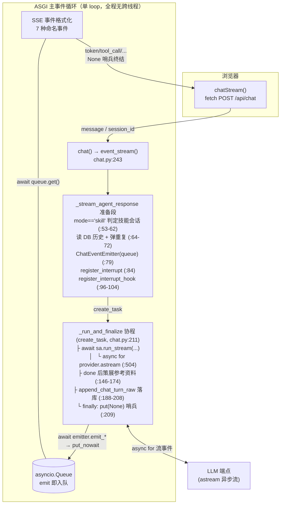
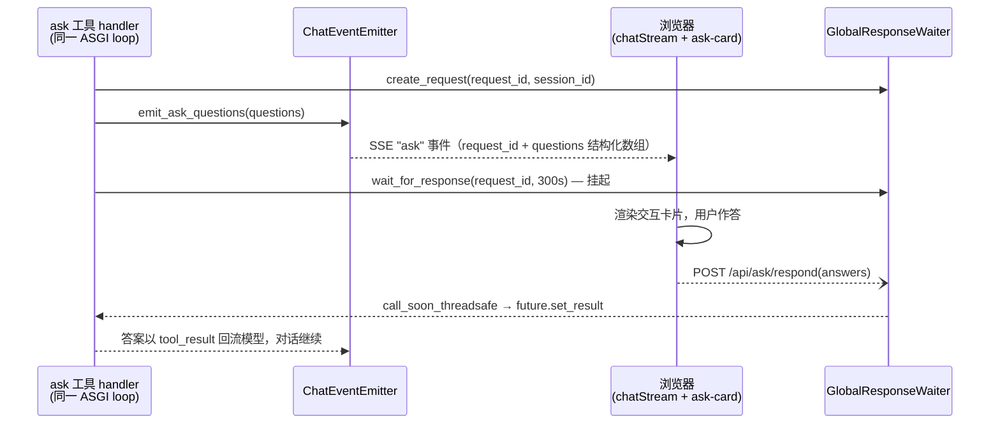

# Web SSE 实现逻辑分析

> 生成日期：2026-09-01 · 基于全 async 化改造后的代码（commit `0ebb0853`，"SSE 聊天链路全 async 化——StreamingAgent 直跑 ASGI 主 loop"）
> 覆盖文件：`doclens/web_v2/api/chat.py`、`api/_chat_emitter.py`、`chat_interrupt.py`、`frontend/src/api/chat.ts`、`frontend/src/api/client.ts`、`frontend/src/api/ask.ts`
> 相关文档：[ARCHITECTURE-ask-loopback.md](./ARCHITECTURE-ask-loopback.md)（ask 回环详解）、[ARCHITECTURE-event-flow.md](./ARCHITECTURE-event-flow.md)（emitter 积累器与 queue 事件流详解）、[planify/docs/DESIGN-async-refactor.md](../../../planify/docs/DESIGN-async-refactor.md)（本次改造设计）

## 一、链路总览



**单 loop 直推模型**：StreamingAgent 与 SSE 生成器跑在同一个 ASGI 事件循环上，事件在发生处直接入 `asyncio.Queue`——零轮询、零跨线程调度、顺序天然等于发生顺序。

> 历史背景：改造前是「生成线程私有 loop + `call_soon_threadsafe` 桥接 + `_feed` 50ms 轮询 diff」的双 loop 架构（根因：provider.stream 是同步迭代器会阻塞 loop）。改造设计动机与迁移过程见 `planify/docs/DESIGN-async-refactor.md`。

## 二、后端三层拆解

### 1. 入口层（`chat.py:243-289`）

- `POST /api/chat` → `event_stream()` 异步生成器 → `EventSourceResponse`（sse-starlette）。
- 内部事件 dict 映射为 **7 种 SSE 命名事件**：`token` / `tool_call` / `tool_result` / `ask` / `toast` / `error` / `done`，data 均为 JSON。
- **客户端断开兜底**（`:279-284`）：`asyncio.CancelledError` → `request_stop(session_id)` + 生成器 finally 里 `agent_task.cancel()`——`CancelledError` 沿 await 链传播到 `astream`/工具 await，堵住「前端不读了，后端继续烧 token」的泄漏。

### 2. 事件层（queue + ChatEventEmitter 直推）

- `asyncio.Queue` 属主 = ASGI 主 loop = `emit` 调用方所在 loop，`put_nowait` 无需任何线程安全措施（`:84`）。
- 消费端 `while True: chunk = await queue.get()`（`:214-218`），`None` 哨兵终结（`:209`）——哨兵在 `_run_and_finalize` 的 **finally** 投放，无论成败流必然终结。
- 哨兵后透传未捕获异常（`:220-224`）：agent 任务异常且未被内部处理时，转 `error` 事件给前端。

### 3. 生成层（`_run_and_finalize`，`chat.py:131-203`）

单一协程顺序执行：`run_stream`（内部 `async for provider.astream` 消费 LLM 流，事件在 await 点直推）→ 策展参考资料 → 透传 `emitter.error` → 推 curated token → 兜底 toast → finally 落库 + 投哨兵。

策展/落库放 finally 的语义：**断开/取消时落库仍执行**（与旧线程版行为一致——半截对话照样存盘）。

## 三、关键机制

### 1. ChatEventEmitter：积累 + 直推双职责（`_chat_emitter.py:27`）

每个 `emit` 分支同时做两件事：

| 事件 | 积累（供策展/落库） | 直推（供 SSE） |
|---|---|---|
| TEXT | `text_parts.append` | ❌ 不推（缓冲到 done 整体推，见下） |
| TOOL_CALL（is_complete） | `tool_calls.append`（含 `_t0` 计时） | ✅ `_push` |
| TOOL_RESULT | 三级降级配对回填（tool_use_id → name → 孤儿记录） | ✅ `_push`（带 `duration_ms`） |
| ASK（questions） | —（2026-09-02 起不再积累；pending 索引归 waiter） | ✅ `_push`（`questions` 结构化数组直传） |
| DONE / ERROR | 置 `done`/`error` 标志 | ❌（由收尾逻辑转 token/error 事件） |

**为什么不再需要 planify 的 `SSEEmitter`**：那个的 queue 绑定创建它的 loop（旧架构里是生成线程私有 loop，主 loop 消费不了）；现在单 loop，`ChatEventEmitter(queue)` 的 emit 即 put，积累职责保留（策展与落库需要完整快照）。

### 2. 正文整体推送 + 参考资料策展（最重要的取舍）

done 后才 `queue.put_nowait({"type": "token", "text": curated_text})`（`:175`），因为正文要过策展重写：

- **技能会话**（`sessions.mode == 'skill'`，见下）→ 提取式：从正文提取真实路径重建章节（`:142`）；
- **普通会话** → 声明式：AI 的「## 参考资料」合规则清洗+重编号对齐 `[N]`；不合规则按工具检索结果分级兜底 + toast（`:151-157`）；
- 策展自身失败降级为原文（`:164-168`），不阻断 token 推送。

**技能会话身份判定**（`chat.py:53-62`）：显式会话属性，非消息内容推导——

```python
skill_session = is_skill_message(message)          # 回退：首轮/无 session_id 时看消息标记
summary = store.get(session_id)
if summary is not None and summary.mode == "skill": # 主判据：创建时写入的会话级声明
    skill_session = True
```

前端从 files 工具箱发起技能对话时 `createSession({ mode: "skill" })` 一次声明，后续每轮读列判定。`sessions_store._init_schema` 含存量迁移（按 seq 取每会话首条 `message_user`，`[调用技能:` 前缀才补 `mode='skill'`，幂等）。消息文本里的 `[调用技能: xxx]` 标记仍保留——那是给 **LLM** 的指令（驱动 load_skill），只是不再承担会话身份判定。

> 历史设计：曾按"扫 DB 首条 user 消息正则推导"判定（首轮看 message、后续轮扫 history），身份锚定在消息内容上——受历史压缩影响、可被消息文本伪造，且每轮重复推导。mode 列化后这些缺陷一并消除。

若边流边推正文，策展重写会造成内容跳变/重复，故牺牲打字机效果换策展完整性。**代价：长回答的正文要等全部生成+策展完才一次性出现**。架构已具备实时推 token 的能力（emit 即入队），开关只在 TEXT 分支——是展示策略而非技术限制。

### 3. 中断机制：三层兜底（`chat_interrupt.py` + `chat.py:225-240`）

按 `session_id` 登记 `threading.Event`（`chat_interrupt.py:39`）+ 中断 hook 集合（`:57`）。`request_stop`（`:73`）= set Event + 逐个调用 hook：

| 层 | 机制 | 覆盖场景 |
|---|---|---|
| 1 Event | agent 在 `astream` 循环检查点退出（`streaming/runner.py:512`） | 正在流式生成 |
| 2 hook | `waiter.interrupt_session(session_id)` 按会话唤醒全部挂起的 ask 等待（2026-09-02 起；原 `interrupt(request_id)` 逐条 + emitter pending_asks 影子表已废除） | **ask 挂起期间**（旧架构的缺口，改造后修复） |
| 3 cancel | `agent_task.cancel()`，CancelledError 沿 await 链传播 | 消费端早退（断开）时的兜底 |

防竞态细节：
- register 在消费开始**前**完成（`chat.py:87-90`：杜绝「stop 早于 register」）；
- unregister 仅当表里是**同一个** event 才删（`chat_interrupt.py:50`：防「停→迅速重发」时旧请求误删新事件）；
- `request_stop` 未命中也执行 hook（流已收尾但 ask 悬置的窗口期可被唤醒）、hook 抛错不阻断停止（`:86-89`）。

waiter 侧配合（`planify/streaming/waiter.py`）：`interrupt(request_id)` 按条摘除并 resolve `{"interrupted": True}`；`interrupt_session(session_id)` 按会话批量中断（consumed 互斥，幂等返回中断条数）。ask handler 醒来检查该标志返回中断说明（`planify/tools/user_interaction.py`），模型看到后配合退出。

触发源两个：`POST /chat/stop`（`chat.py:292`）和 SSE 客户端断开（`:279-284`）。

### 4. ask 双向回环（SSE 单向的补丁）

SSE 只能服务端→客户端，用户应答走独立回路：



单 loop 化后回环两侧（ask handler 与 respond 端点）天然同 loop，`submit_response` 经 `call_soon_threadsafe` 排回本 loop resolve（同 loop 调用等价排队，CLI 跨线程场景仍安全）。

> 完整时序、Future 化细节与边界情况，见 [ARCHITECTURE-ask-loopback.md](./ARCHITECTURE-ask-loopback.md)。

### 5. 持久化时序（展示层与回放层分离）

1. **发送前**：前端 `appendSession` 落库 `message_user`（若失败则不发起 SSE 请求——这是 `chat.py:61-66` 弹出重复消息的前提约定）；
2. **done 后（后端）**：`append_chat_turn_raw` 落库 tool 链 + 模型**原始**输出（`:202-204`，只落库已配对的调用，中断残留丢弃）；
3. **done 后（前端）**：另写 `message_ai`（策展后文本）。

下轮回放 `get_chat_history` 优先 `message_ai_raw`——LLM 上下文用原始版，前端展示用策展版。

## 四、前端消费端

- **为什么不用 `EventSource` API**：它只支持 GET；这里要 POST JSON body，所以 `streamSSE`（`client.ts:41`）用 `fetch` + `res.body.getReader()` + `TextDecoder` 手工解析。
- 解析器遵循 SSE 规范的三种事件分隔符 `\r\n\r\n` / `\r\r` / `\n\n`（`client.ts:65`），跨 chunk 残留进 buffer 续拼。
- `chatStream`（`chat.ts:13`）把 SSE 事件转回类型化 `ChatStreamEvent` 联合类型，JSON parse 失败静默跳过（不中断流）。
- `stopChat` fire-and-forget：网络/鉴权失败静默（`chat.ts:68-70`），不阻塞前端把对话收尾。

## 五、设计取舍与残留风险

| # | 观察 | 影响 |
|---|---|---|
| 1 | **正文非真流式**（token 缓冲到 done 整体推） | 长回答无打字机效果；架构已支持实时推（改 TEXT 分支即可），当前是策展完整性优先的展示策略 |
| 2 | agent 与 SSE 消费共享同一 loop | CPU 密集型同步代码（如策展正则、大 JSON 序列化）会短暂阻塞事件运输——策展实测为毫秒级，暂无需 worker 化 |
| 3 | ~~复用全局单例 `agent.session` + 每请求 `bind_user_interaction_handlers` 重绑~~ | ✅ 已修复（2026-09-02 边界修复）：每请求对 `session.tool_handlers` 做浅拷贝再 bind，同 session 并发两流不再互相覆盖；残留假设仅剩「单会话单流」本身 |
| 4 | `history[-1]` 弹出防重复依赖前端落库约定（`:64-72`） | 约定破坏（如手动 curl 带 session_id）会双写本轮消息 |
| 5 | 中断的半截文本仍会走策展 + 推送 | `emitter.error` 先于 token 推 error 事件，前端可据此弃用该 token；落库保留半截对话（有意的） |
| 6 | `threading.Event` 而非纯 asyncio 取消 | 兼容 CLI/TUI 同步路径的统一中断接口；检查点粒度 = 事件粒度（每个 astream 事件检查一次，足够细） |

## 六、与旧架构对照（改造收益速查）

| 维度 | 旧（双 loop + 线程桥接） | 新（单 loop 直推） |
|---|---|---|
| 事件延迟 | 平均 ~25ms（50ms 轮询周期一半） | 0（emit 即入队） |
| 事件顺序 | 去重集合维护的近似不变量 | 结构保证 = 发生顺序 |
| ask 挂起期间停止 | ❌ 无效，干等 300s 超时 | ✅ hook 秒级唤醒 |
| 关页/断开后 | 生成线程照跑完自然结束 | ✅ cancel 秒级收尾 + 落库 |
| 跨线程竞态 | `event.set()` 靠 GIL 兜底（注释自述理论竞态） | waiter 经 `call_soon_threadsafe` resolve（含 consumed 一次性标记） |
| 代码量 | 桥接层 ~130 行（线程/loop/queue/`_put`/`_feed`） | 直推 ~40 行 |
