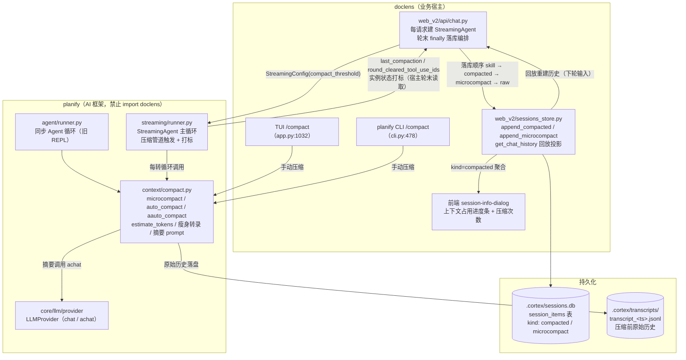
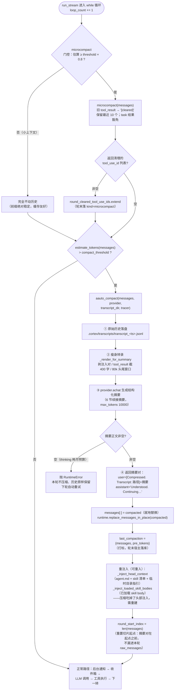
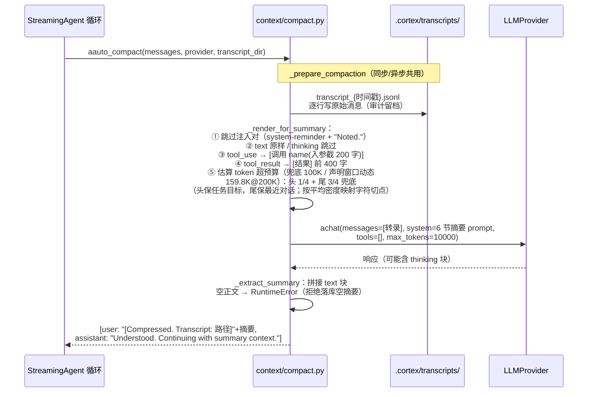
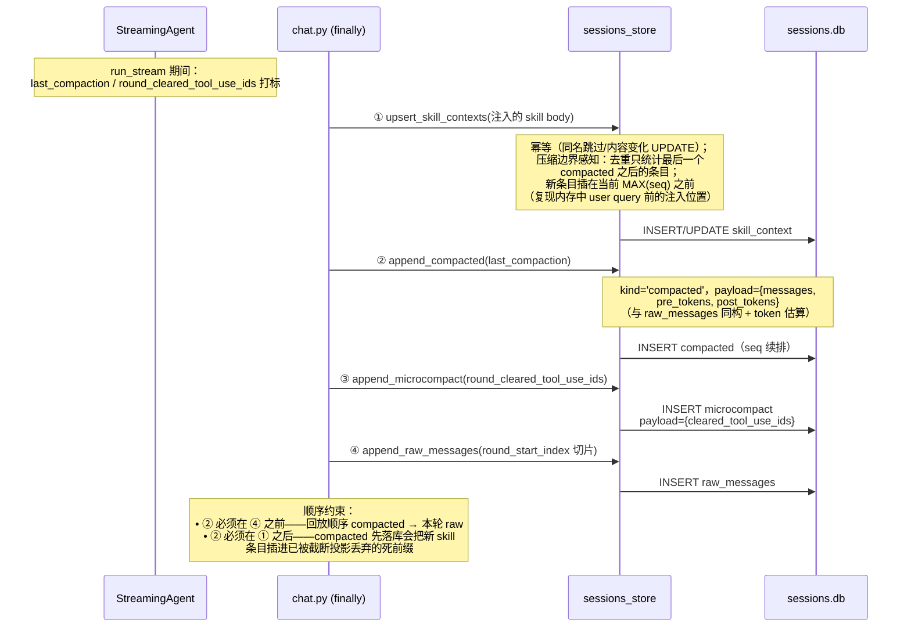
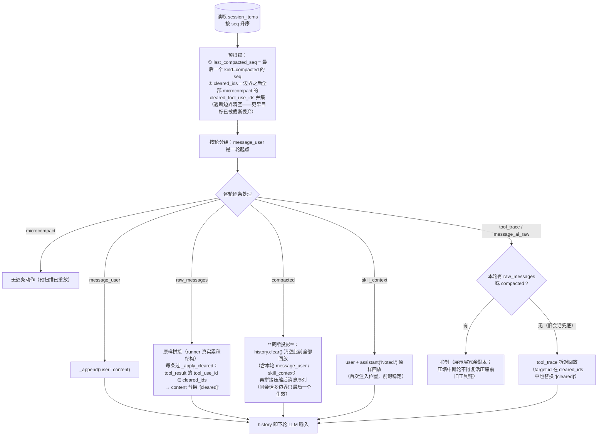
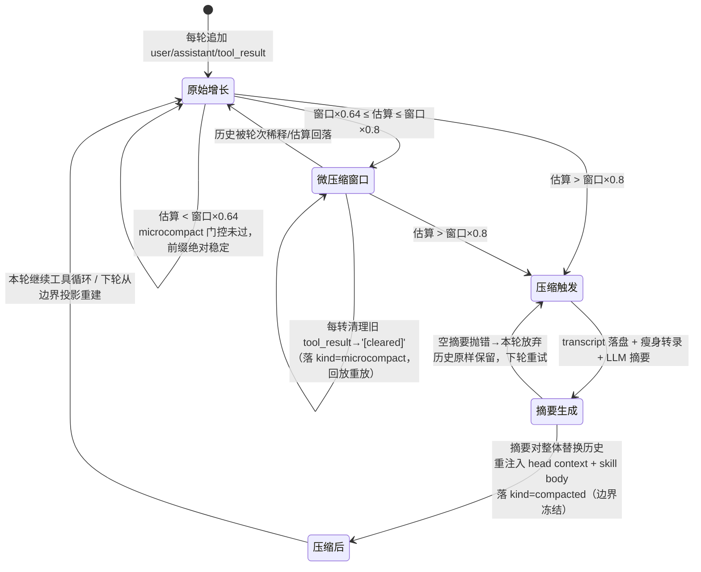

# Compact 业务逻辑（上下文两级压缩）

> 覆盖范围：`planify/context/compact.py`（算法核心）、`planify/streaming/runner.py`（主循环触发）、`planify/agent/runner.py`（同步路径）、`doclens/web_v2/api/chat.py` + `sessions_store.py`（落库与回放，ADR-0026 压缩即事实）、TUI/CLI 手动压缩、前端会话信息展示。
>
> 设计决议详见 [ADR-0026 compact-as-fact](./adr/0026-compact-as-fact.md)。

## 1. 一句话总览

对话历史超过阈值时用两级策略控制上下文体积：**microcompact**（微压缩——把旧工具结果清成 `"[cleared]"`）和 **auto_compact**（自动压缩——LLM 生成摘要对整体替换历史）。Web 链路遵循「**压缩即事实**」：压缩事件落库一次冻结，回放侧从边界做确定性投影，不再每轮重压缩。

## 2. 关键参数

| 参数 | 值 | 位置 | 说明 |
|------|-----|------|------|
| `compact_threshold` | `planify_context_window × 0.8` | `chat.py:159` / `cli.py:416` / `doclens/config.py:297` | auto_compact 触发阈值 |
| `MICROCOMPACT_KEEP_DEFAULT` | 10 | `compact.py:185` | 微压缩保留最近 N 个工具结果 |
| `MICROCOMPACT_GATE_RATIO` | 0.8 | `compact.py:193` | 微压缩门控 = threshold × 0.8（即窗口 × 0.64） |
| `MICROCOMPACT_EXEMPT_TOOLS` | `{task}` | `compact.py:181` | 子代理摘要结果永不清理（防并发 task 产出丢失） |
| `estimate_tokens` | ASCII `len(json)//4`；非 ASCII ≈1 token/字符（`ensure_ascii=False`） | `compact.py:32` | 启发式估算；压缩触发另有 usage 实测基线打底（见下） |
| `estimate_tokens_with_usage` | `usage 总输入(实测) + 增量 ÷4` | `compact.py` | 触发主口径（借鉴 Claude Code `tokenCountWithEstimation`）：基线含 system prompt 与工具表，误差限增量部分；无基线/历史被压缩替换时全量 ÷4 兜底 |
| `_SUMMARY_MAX_TOKENS_FLOOR` | 10 000 | `compact.py` | 摘要输出上限**下限**（thinking 型模型需给思考留余量）；实际取 `summary_output_cap()` = max(下限, `PLANIFY_MAX_TOKENS`)——大输出模型（配 131072 等）跟随配置放开 |
| `summary_input_budget()` | `(窗口 − 输出预留 − 2K) × 0.85` | `compact.py` | 输入预算的输出预留随输出上限**联动**（窗口是输入+输出共享约束）：200K 窗口/默认输出 → 159.8K；200K/131072 输出 → 56.9K |
| `_SUMMARY_INPUT_TOKEN_BUDGET` | 100 000 token（兜底；头 1/4 + 尾 3/4） | `compact.py` | 摘要输入 token 预算**兜底值**（对齐最保守 128K 摘要端点）；宿主声明窗口（`PLANIFY_CONTEXT_WINDOW` → `StreamingConfig.context_window`）时经 `summary_input_budget()` 动态放大：(窗口−12K)×0.85，200K 窗口 → 159.8K。ASCII ÷4 / 非 ASCII ≈1 token/字符计量 |
| `_TOOL_RESULT_CHARS` / `_TOOL_INPUT_CHARS` | 400 / 200 | `compact.py:59` | 转录中单条工具结果/入参保留量 |
| 清理幂等线 | content 长度 > 100 | `compact.py:249` | 已是 `"[cleared]"` 的结果不重复清理 |

## 3. 分层总览

**模块边界**：压缩发生在 planify 循环内，但 planify 不感知存储——runner 把结果记在实例状态（打标），doclens 轮末读取落库，不新增反向契约（ADR-0026 决议 3）。

## 4. StreamingAgent 主循环压缩管道

`run_stream`（`streaming/runner.py:301`）每轮开头重置打标、注入上下文，然后进入 while 循环；**每转**都先过压缩管道再调 LLM：

**缓存友好设计**（`compact.py:184-193` 注释）：GLM / MiniMax 等整体前缀匹配端点上，历史中段任何单点突变会使突变点之后的缓存全部失效并全价重算（双倍代价）；保留旧 tool_result 的成本只是缓存命中价。因此 microcompact 推迟到窗口 × 0.64 才发生，小/中上下文保持前缀绝对稳定。

## 5. auto_compact 摘要生成细节

**结构化摘要 6 节**（`compact.py:67-78`，接收方只有摘要看不到原文）：① 任务目标 ② 关键决策与结论 ③ 关键文件与路径 ④ 重要约束 ⑤ 未完成事项 ⑥ 最近工作详情（转录末尾逐轮记录，**最重要、宁长勿短**——续接工作直接接这里）。

**transcript 目录选择**（`runner.py:372-375`）：宿主注入 `compact_transcript_dir`（doclens 注 `.cortex/transcripts`，避免落盘触发 FileWatcher 索引回路）优先；未注入时退回 `<workdir>/.transcripts/`。

## 6. Web 链路：轮末落库（ADR-0026 压缩即事实）

`chat.py` 每请求新建 StreamingAgent，轮末 `finally` 按固定顺序落库——**顺序 load-bearing**：

**防御性**：`getattr(sa, "last_compaction", None)`——PyPI 旧版 planify 无打标属性时静默跳过，退化为旧行为（下轮重压缩一次）；落库失败仅 warning，不影响对话返回。

## 7. 回放投影：get_chat_history（sessions_store.py:620）

Web 链路每轮从 DB 重建 LLM 输入历史（**历史真相在宿主 SQLite**，`run_stream` 返回值被丢弃）：

**回放正确性目标**：重放与真实请求**逐字节一致**——80%–100% 阈值窗口内跨轮前缀不再分叉（microcompact 重放），压缩轮不走 tool_trace 兜底（compacted 抑制）。

## 8. 上下文生命周期状态图

## 9. 多入口对照

| 入口 | 路径 | 压缩方式 | 落库 |
|------|------|----------|------|
| Web 自动（主力） | `chat.py` → `StreamingAgent.run_stream` | `aauto_compact`（异步，不阻塞事件循环） | runner 打标 → 轮末 `append_compacted` / `append_microcompact` |
| 旧 REPL 自动 | `planify/agent/runner.py` | `auto_compact`（同步） | 无（内存路径） |
| planify CLI 手动 | `cli.py:478` `/compact` | `auto_compact`（同步） | 无 |
| doclens TUI 手动 | `tui/app.py:1032` `_cmd_compact` → worker 线程 → agent_integration `compact` 命令 | `auto_compact`（同步） | 无（TUI/CLI 明确不做，ADR-0026 决议 8） |

## 10. 前端展示

`session-info-dialog.ts`：上下文占用进度条（阈值线 = 窗口 × 0.8，≥80% 变警告色并提示「将自动压缩历史」）；压缩次数 `compactionCount`（`kind="compacted"` 条目数，0 则隐藏压缩行）；最近压缩时间。对话流**不**插压缩分隔条（ADR-0026 决议 7——展示层与 LLM 回放双通道，前端历史仍显示全量对话）。

## 11. 设计要点速查（为什么长这样）

1. **压缩即事实**（ADR-0026）：压缩产物落库一次冻结，读取方纯函数投影——消除每轮重压缩的重复摘要成本、压缩轮前缀分叉、微压缩跨轮分叉三个痛点。
2. **全量摘要不保尾**：Claude Code 保留尾部是为 reactive compact 的 prompt-too-long 重试服务；doclens 无 fork 链模型，且压缩瞬间前缀全变、缓存必然重建，保留尾部无收益。
3. **空摘要拒绝落库**：thinking 型模型输出预算可能被思考耗尽（正文 0 输出）——静默落库空摘要会把上下文丢掉，抛错让本轮整体失败更安全。
4. **task 结果豁免微压缩**：并发派出 N 个子代理后，排在前面的 task 结果被清成 `"[cleared]"` 会让主代理丢失大部分子代理产出（summarize-files 并发模式实测踩中）。
5. **估算口径**（2026-09-18 升级，原 ADR-0026 决议 8 预留的 usage-based 任务）：触发主口径 = **usage 实测基线 + 增量 ÷4**（`estimate_tokens_with_usage`）——上次 LLM 调用的 `input + cache_read + cache_creation` 精确覆盖该次全部输入（含 system prompt 与工具表），此后新增消息才用 ÷4 启发式，误差限增量部分而非全历史；同时消除了与前端弹窗实测口径的分裂。÷4 公式本身改进：`ensure_ascii=False` + 非 ASCII ≈1 token/字符（旧式对中文系统性高估 ~50%）；纯 ASCII 走快速路径，英文场景行为不变。基线失效条件：历史被 auto_compact 整体替换（下次 LLM 响应重建）、suppress_tools 终答调用不更新基线。
