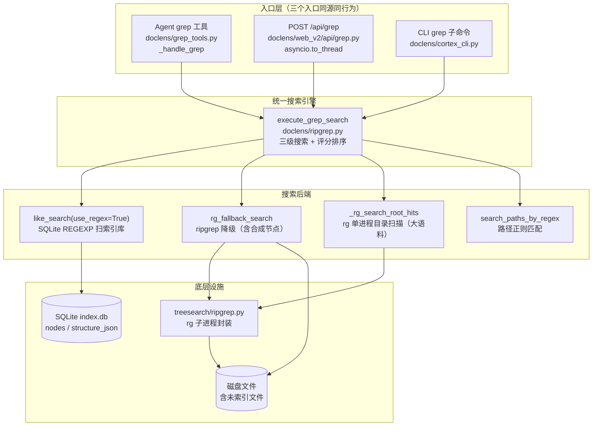

# grep 工具业务逻辑

> grep = 「索引库正则扫描优先 → rg 全盘扫描兜底 → 路径正则匹配补充」的三级合并搜索。
> 大语料自动旁路 SQLite 直通 rg 目录扫描；按词项命中数评分排序；
> Agent 侧以统一锚点窗口截片段、8000 字符预算输出 XML。

## 分层架构



## 核心搜索流程（execute_grep_search）

```mermaid
flowchart TD
    START(["execute_grep_search(idx, query)"]) --> TERMS["_extract_terms<br/>按顶层 &#124; 分割正则 → 词项列表<br/>（跳过括号内嵌套 &#124;；无分割则整 pattern 为单词条）"]

    TERMS --> PF{"paths 目标过滤?"}
    PF -->|"有 paths"| PFR["resolve_search_targets → allowed 集合<br/>path_map 收敛到目标内<br/>LIKE 候选量放大 max(200, 4×max_results)<br/>（防截断在前、过滤在后丢结果）"]
    PF -->|"无"| BYPASS
    PFR --> BYPASS{"nodes 行数 &gt; 10 万？<br/>_nodes_count_bypass<br/>（计数按 db_path 缓存 TTL 10min）"}

    BYPASS -->|"是 · 大语料旁路<br/>REGEXP 逐行 UDF 分钟级，不可用"| SKIPLIKE["跳过 LIKE(REGEXP)<br/>like_results = 空"]
    BYPASS -->|"否"| LIKE["like_search(query, use_regex=True)<br/>SQLite REGEXP 扫索引库"]

    LIKE --> HASLIKE{"有结果?"}
    HASLIKE -->|"有"| BACKFILL["过滤 allowed → 转 tuple<br/>_fulltext_for_node 回填全文<br/>（summary 是截断窗口，<br/>从 structure_json 找回完整 text）"]
    HASLIKE -->|"无"| FALLBACK
    SKIPLIKE --> FALLBACK{"rg 降级搜索<br/>大语料旁路 且 无目标过滤?"}

    FALLBACK -->|"是"| ROOTHITS["_rg_search_root_hits<br/>rg 单进程递归扫根目录（原生并行）<br/>排除 .cortex / .treesearch / .git / ._*.md<br/>51 万文件实测 10-30s"]
    ROOTHITS --> BINBAK["二进制文档兜底 _binary_doc_ids<br/>rg 搜不了 pdf/docx 磁盘原文<br/>（shadow md 已废弃，解析文本只在索引库）<br/>→ REGEXP 限定二进制子集扫描<br/>→ 与 rg 文本结果并集去重<br/>（doc_id 相同保留 rg 结果）"]
    FALLBACK -->|"否"| MERGEPATH["_rg_fallback_path_map<br/>合并磁盘未索引文件（伪 doc_id）<br/>复用 resolve_paths 同索引器忽略规则"]
    MERGEPATH --> BATCHRG["rg_fallback_search 逐文件分批<br/>rg 命中 + 索引无节点 → 读文件生成合成节点<br/>（带 source_path，锚点 ±上下文行）"]

    BACKFILL --> PATHRX
    BINBAK --> PATHRX
    BATCHRG --> PATHRX["search_paths_by_regex<br/>pattern 对文件路径匹配<br/>产出 [路径匹配] 节点"]

    PATHRX --> SCORE["_count_term_hits 评分<br/>统计文本实际命中词项数<br/>（正则失败退字面量子串）<br/>按命中数降序排序"]
    SCORE --> THRESH{"grep_score_threshold &gt; 0?"}
    THRESH -->|"命中数/词项数 &lt; 阈值"| DROP["过滤掉（内容 + 路径同口径）"]
    THRESH -->|"通过"| TRUNC["截断到 grep_max_results"]
    DROP --> TRUNC
    TRUNC --> RESULT(["GrepResult<br/>content_results + path_results + query_words"])
```



## Agent 输出格式化（_format_agent_output）

```mermaid
flowchart TD
    IN(["GrepResult"]) --> FMT["_format_agent_output<br/>与 search_kb 输出格式对齐"]
    FMT --> RX{"词项正则合法<br/>且全文有命中?"}

    RX -->|"是"| REGEXLED["_regex_led_snippet 统一锚点窗口<br/>[锚点前 before 字符]<br/>+ [命中体 ≤ match_max]<br/>+ [锚点后 after 字符]<br/>自声明跨度正则（如 第29题&#91;&#92;s&#92;S&#93;{0,300}）<br/>命中体本身即跨度"]
    RX -->|"否 / 不合法"| LINEANCH["_select_keyword_lines 行锚点<br/>每行统计词项命中数 → 降序取 3 锚点行<br/>± 1 行上下文拼接 → 截 200 字符"]

    REGEXLED --> RESOLVE
    LINEANCH --> RESOLVE["doc_id → path 解析（三级兜底）<br/>① 合成节点自带 source_path<br/>② path_map 查表<br/>③ resolve_doc_path（应对重索引 doc_id 漂移）"]

    RESOLVE --> XML["拼 XML 结果<br/>&lt;result index score matches&gt;<br/>&lt;path&gt;路径:行号&lt;/path&gt;<br/>&lt;content&gt;片段&lt;/content&gt;"]
    XML --> BUDGET{"累计输出 &gt; 8000 字符?"}
    BUDGET -->|"是"| TRUNCN["截断 + 尾注<br/>(N more results truncated.<br/>Use max_results parameter…)"]
    BUDGET -->|"否"| OUT(["完整 XML 输出"])
    TRUNCN --> OUT2(["截断输出"])
```



## Agent 调用时序

```mermaid
sequenceDiagram
    participant LLM as AI Agent (LLM)
    participant GT as _handle_grep<br/>grep_tools.py
    participant ENG as execute_grep_search<br/>ripgrep.py
    participant IDX as IndexManager<br/>like_search
    participant RG as rg 子进程
    participant FMT as _format_agent_output

    LLM->>GT: grep(pattern, paths?)
    Note over GT: paths 经 resolve_search_targets<br/>解析为 allowed 集合
    GT->>ENG: execute_grep_search(query, allowed)
    Note over ENG: _extract_terms 按顶层 &#124; 分割词项

    alt nodes ≤ 10 万（小语料）
        ENG->>IDX: like_search(use_regex=True)
        IDX-->>ENG: LIKE 命中节点
        Note over ENG: _fulltext_for_node<br/>回填 structure_json 全文
    else nodes &gt; 10 万（大语料旁路）
        ENG->>RG: _rg_search_root_hits 目录扫描
        RG-->>ENG: {绝对路径: [行号]}
        ENG->>IDX: REGEXP 限定二进制子集（pdf/docx）
        IDX-->>ENG: 二进制命中（与 rg 并集去重）
    end

    opt LIKE 无结果（且非大语料旁路）
        ENG->>RG: rg_fallback_search 逐文件分批
        Note over ENG: path_map 已合并磁盘未索引文件<br/>未索引命中 → 合成节点
    end

    ENG->>ENG: search_paths_by_regex 路径匹配
    ENG->>ENG: 评分排序 → 阈值过滤 → 截断
    ENG-->>GT: GrepResult
    GT->>FMT: 格式化（context/limit 参数来自 config）
    Note over FMT: _regex_led_snippet 锚点窗口<br/>失败退行锚点选择
    FMT-->>GT: XML（≤ 8000 字符预算）
    GT-->>LLM: XML 搜索结果
```

## 关键设计点

| 设计点 | 机制 | 代码位置 |
|---|---|---|
| 三入口同源 | Agent 工具 / Web API / CLI 均调 `execute_grep_search`，行为一致 | `ripgrep.py:490` |
| 大语料旁路 | nodes > 10 万跳过 REGEXP（逐行 Python UDF 分钟级卡死对话流），直通 rg 目录扫描（原生并行同规模数十秒） | `ripgrep.py:26`、`ripgrep.py:220` |
| 二进制兜底 | rg 搜不了 pdf/docx 原文（shadow md 已废弃），REGEXP 限定二进制 doc_id 子集扫描后并集去重 | `ripgrep.py:294` |
| 未索引文件覆盖 | `_rg_fallback_path_map` 复用索引器同套忽略规则发现磁盘文件，兑现「搜索所有文件（包括未索引的）」承诺 | `ripgrep.py:435` |
| 全文回填 | LIKE 命中节点的 summary 是索引期截断窗口，从 structure_json 找回完整 text | `ripgrep.py:461` |
| 统一锚点窗口 | `[锚点前 before] + [命中体 ≤ match_max] + [锚点后 after]`，与 search 的关键词窗口同口径；窗口/上限参数来自 config | `grep_tools.py:240` |
| 输出预算 | Agent XML 总输出 8000 字符上限，超出截断并提示用 max_results 取更多 | `grep_tools.py:30` |
| doc_id 漂移兜底 | path_map 未命中走 `resolve_doc_path`，应对后台重索引 | `grep_tools.py:173` |
| 目标过滤防丢 | 有 allowed 时 LIKE 候选量放大 4 倍，先放大后过滤 | `ripgrep.py:526` |

## 相关文件

| 文件 | 职责 |
|---|---|
| `doclens/grep_tools.py` | Agent grep 工具 schema + 处理器 + XML 输出格式化 |
| `doclens/ripgrep.py` | 统一搜索引擎（三级搜索、大语料旁路、评分排序） |
| `doclens/web_v2/api/grep.py` | `POST /api/grep`（线程池执行，异常返空结果集） |
| `treesearch/ripgrep.py` | rg 子进程封装（rg_search / rg_available / rg_path） |
| `tests/test_grep_corpus_bypass.py` | 大语料旁路测试 |
| `tests/test_grep_regex_snippet.py` | 正则锚点窗口测试 |
