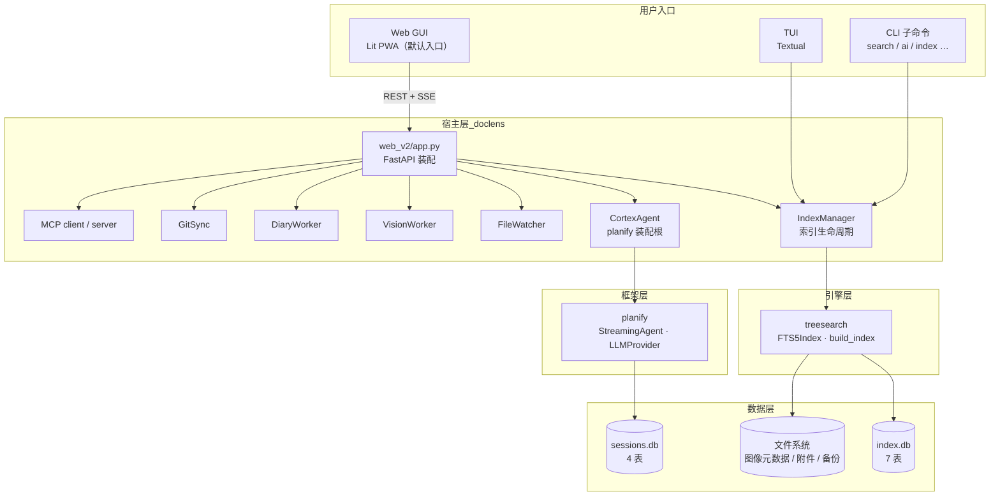
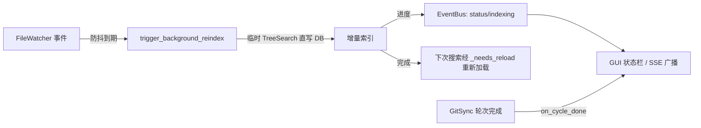
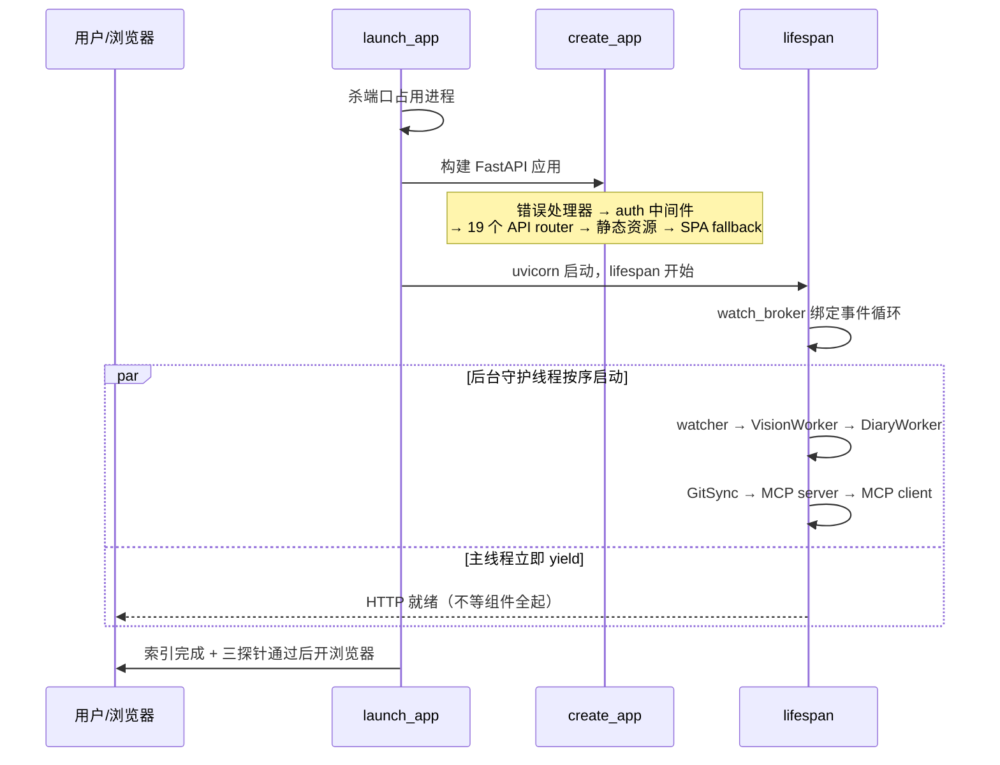
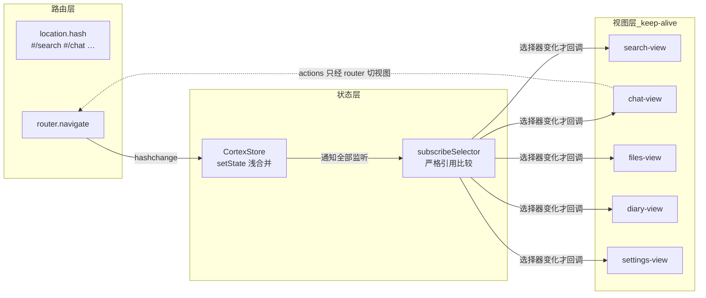
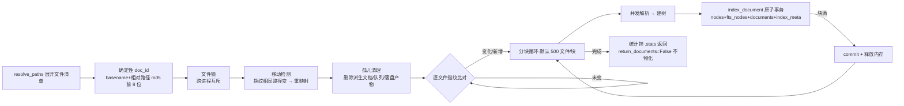
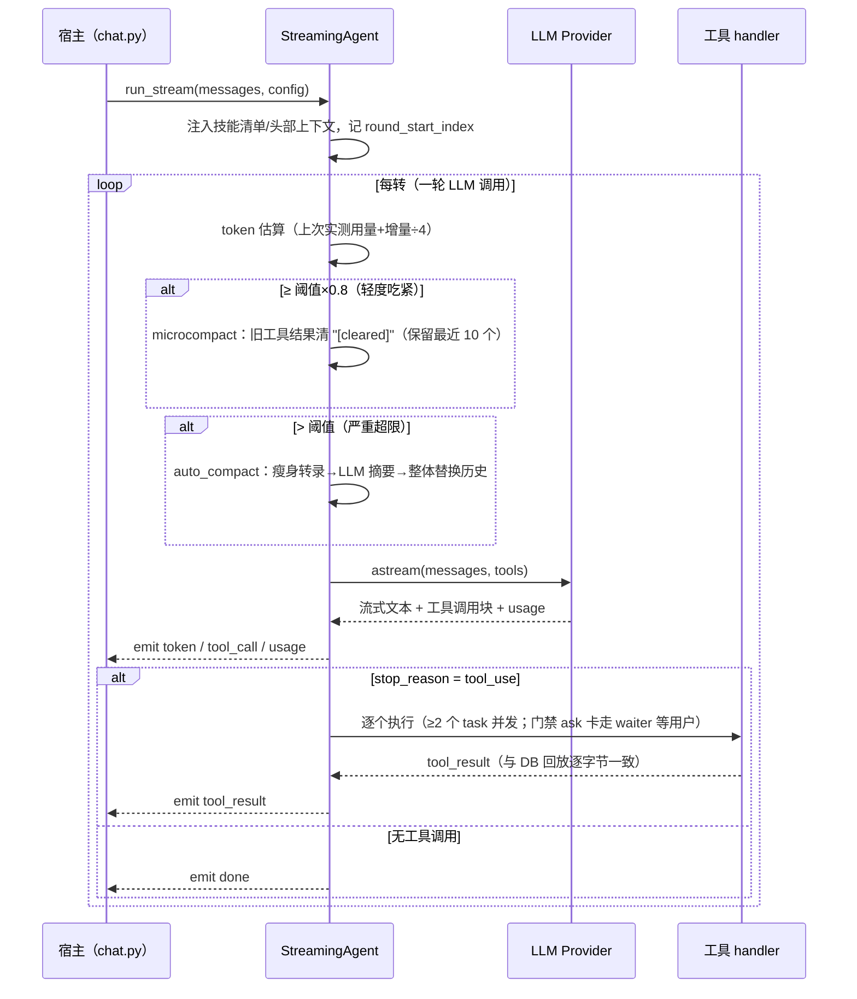
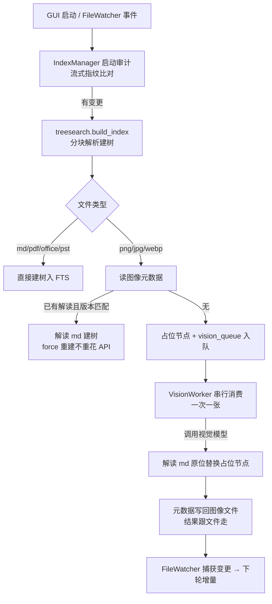
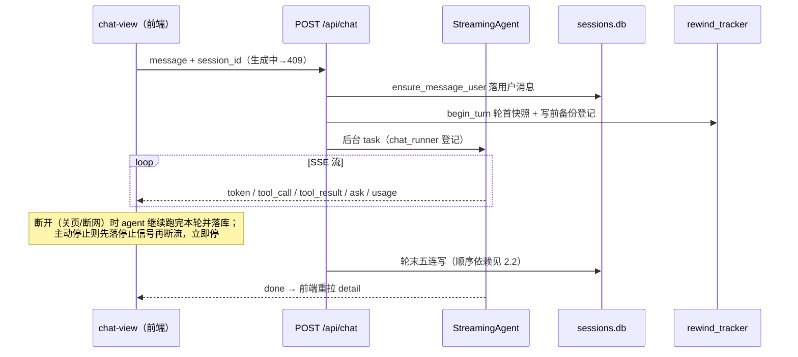
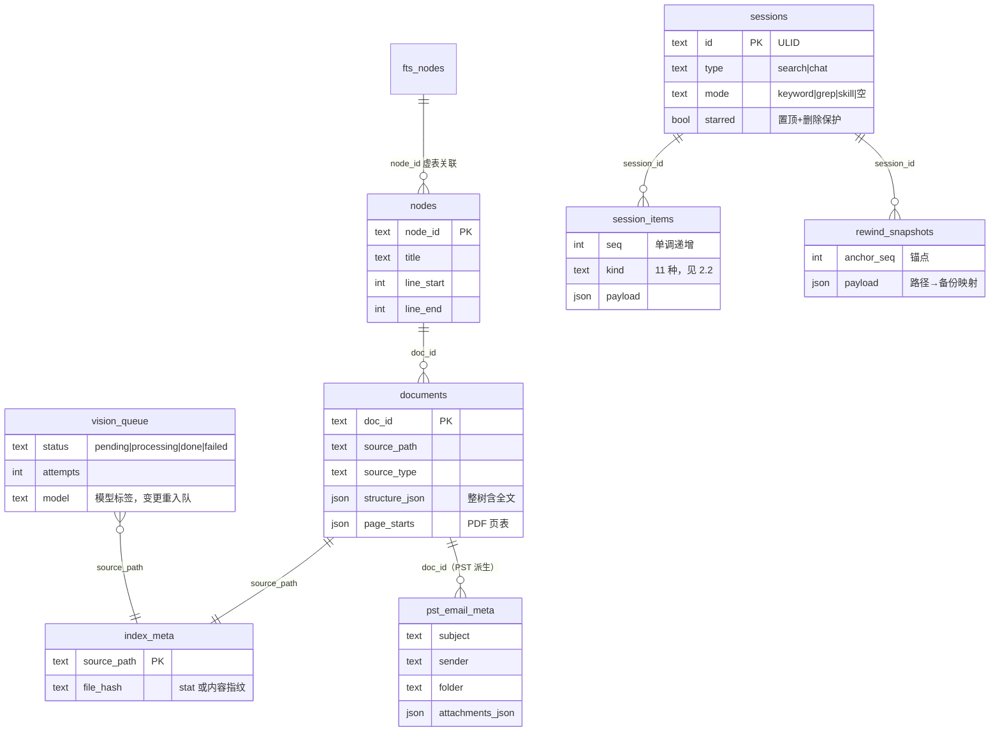
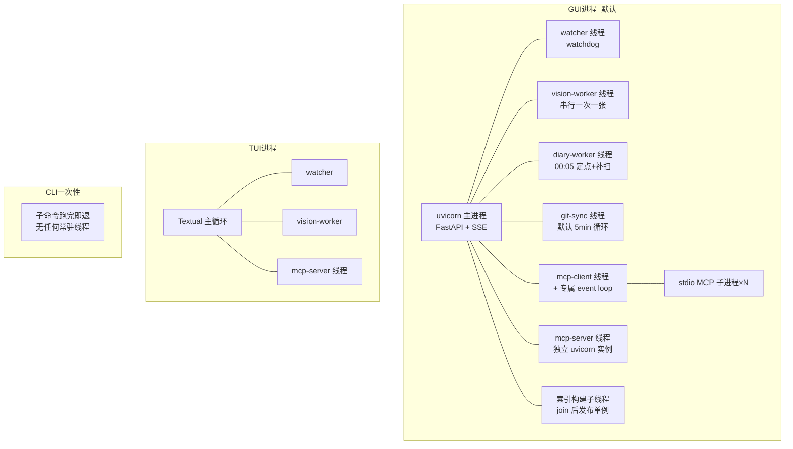

# doclens 架构（项目全貌）

> ⚠ 构建产物：本文件由 repo-wiki 技能全量重生成，勿手改。
> 生成日期：2026-10-03｜基于代码现状，与现有文档冲突处以代码为准并已标注。

## 目录

1. [全局总览](#1-全局总览)
2. [五域分章](#2-五域分章)
   - [2.1 doclens 核心域](#21-doclens-核心域)
   - [2.2 web_v2 后端域](#22-web_v2-后端域)
   - [2.3 前端域](#23-前端域)
   - [2.4 treesearch 索引引擎域](#24-treesearch-域)
   - [2.5 planify AI 框架域](#25-planify-域)
3. [横切视图](#3-横切视图)
   - [3.1 端到端流程](#31-端到端流程)
   - [3.2 对外接口面](#32-对外接口面)
   - [3.3 数据与持久化](#33-数据与持久化)
   - [3.4 运行时拓扑](#34-运行时拓扑)
   - [3.5 配置面](#35-配置面)
   - [3.6 测试与架构守卫](#36-测试与架构守卫)
   - [3.7 构建与发布](#37-构建与发布)
   - [3.8 安全面摘要](#38-安全面摘要)
4. [附录：文档-代码冲突清单](#附录文档-代码冲突清单)

---

## 1. 全局总览

**doclens**（发行版 v1.2.38）是一款本地优先的知识库检索与 AI 对话工具。它把个人文档库（Markdown、PDF、Office 文档、PST 邮件、图像等）建成结构感知索引——标题、正文、代码块分层存储，供终端用户以三种形态使用：Web GUI（默认入口，PWA）、TUI 终端界面（需显式 `doclens tui`）、一次性 CLI 子命令。数据全部留在本地（SQLite + 文件系统），跨机器同步靠知识库自身的 Git 仓库完成。

AI 对话能力由自研的 **planify** 框架提供（Anthropic / OpenAI 兼容双后端），索引引擎由自研的 **treesearch** 提供（SQLite FTS5 + BM25 + jieba 分词）。这两个库与宿主 doclens 分层严格：宿主可以依赖它们，它们之间互不依赖、也不反向 import 宿主（由 `tests/test_architecture.py` 机械化守护）。

### 技术栈

| 层 | 技术 |
|---|---|
| TUI | Textual + Rich |
| Web 后端 | FastAPI + uvicorn + SSE（sse-starlette） |
| Web 前端 | Lit Web Components + Vite + Shoelace，PWA（sw.js） |
| AI 框架 | planify（自研，Anthropic / OpenAI-compat 双后端，prompt caching） |
| 索引引擎 | treesearch（自研，SQLite FTS5 + BM25 + jieba） |
| 文件监控 | watchdog |
| 视觉 | OpenAI-compat / Anthropic 视觉模型（默认 qwen-vl 系） |
| PST 邮件 | Go sidecar（`tools/pst-extract`，流式 JSONL） |
| 遗留 Office | anydoc（Rust）+ MarkItDown 双引擎 |
| MCP | 双向：内置 server（Streamable HTTP）+ 外部 client（stdio/HTTP/SSE） |
| 配置 | Pydantic + pydantic-settings，多级 .env |
| 测试 | pytest（80 文件）+ Vitest + Playwright |

### 分层架构

*图 1-1：五域分层。宿主 doclens 组装全部后台组件；planify 与 treesearch 互不依赖，只经公共接口被宿主消费。*

### 代码规模

| 域 | 文件数 | 行数 | 说明 |
|---|---|---|---|
| doclens/（Python） | 119 | 24,338 | 宿主：CLI、TUI、web_v2 后端 |
| web_v2/frontend/src（TS） | 115 | 30,061 | Lit 前端（不含测试） |
| treesearch/ | 32 | 14,288 | 索引引擎（含 17 个解析器） |
| planify/ | 58 | 14,714 | AI Agent 框架 |
| tests/ | 80 | 15,193 | pytest 套件 |

**双形态分发**：仓库内三个 Python 包在开发态经 `pip install -e` 直接使用源码；发行版 doclens 不内嵌它们，而是依赖 PyPI 上的 `treesearchlib` 与 `planify`（改底层源码必须发包才进发行版，统一入口 `publish-pypi.ps1`）。

---

## 2. 五域分章

### 2.1 doclens 核心域

**范围**：`doclens/` 包根的 31 个模块（不含 `web_v2/` 与 `tui/` 子包）。这一域是业务宿主：管理工作目录与配置、索引生命周期、搜索评分、AI Agent 装配、以及视觉/日记/Git 同步/MCP 四类后台能力。

#### 模块清单

| 分组 | 模块 | 职责 |
|---|---|---|
| 入口与配置 | `cortex_cli.py` | 总入口 `main()`：工作目录跳转（`-C` > `CORTEX_WORKDIR` > 启动目录）→ 日志 → 子命令分派；裸命令默认进 GUI |
| | `config.py` | `CortexConfig`（pydantic-settings）：全部运行参数、全局与项目双层 .env 合并、首次运行引导 |
| | `agent_integration.py` | `CortexAgent`：doclens 的 planify 装配根——组装运行时、注入 KB/grep 工具、知识库指导文件注入 |
| | `agent_prompt.py` | 宿主侧 system prompt 附加段（KB 根 CLAUDE.md/AGENTS.md 注入） |
| 索引生命周期 | `index_manager.py` | `IndexManager`：TreeSearch 封装、启动审计、后台/前台重建、惰性搜索 |
| | `file_watcher.py` | watchdog 递归监控 + mtime/size 去重 + 防抖触发后台重建 |
| | `event_bus.py` / `events.py` | 进程内发布/订阅事件总线（indexing 进度等） |
| 搜索与评分 | `scoring.py` / `scoring_pipeline.py` | 纯计算评分；FTS→LIKE→ripgrep 三级降级统一管道 |
| | `ripgrep.py` | grep 编排：索引内正则 → rg 子进程 → 路径正则；大语料（>10 万节点）旁路 SQLite 直通 rg |
| | `search_targets.py` / `word_window.py` | 限定范围搜索的 paths 解析；中文词单位窗口换算 |
| KB 工具 | `kb_tools.py` | 供 AI 消费的五个知识库工具（下表） |
| | `grep_tools.py` | `kb_grep` 工具，包装统一 grep 编排 |
| | `skill_gate.py` | KB 工具「先 load_skill 再用」弹回门禁；**当前强制关闭**（`GATE_ENABLED=False`，2026-08-17 决议，代码路径保留） |
| 技能管理 | `skills_config.py` | 机器级 sidecar `skills_config.json`：启用/停用/删除三分状态、稀疏覆盖 |
| | `skills_deploy.py` / `skills_installer.py` | 内置技能启动强制覆盖部署；GitHub zip 安装外部技能 |
| | `claude_code_skill.py` | 把 kb-ask 技能同步到 `~/.claude/skills/`（供 Claude Code 使用） |
| 视觉 | `vision_client.py` | 视觉模型统一入口；全局串行锁（转写/判向/caption 互斥防限流） |
| | `vision_worker.py` | 串行消费 vision 队列，解读完成后原位替换占位节点 |
| | `image_orienter.py` | 上传图判向（0/90/180/270 严格解析）+ 像素级旋转重编码 |
| 日记 | `diary.py` / `diary_worker.py` | 年度 Markdown 两态读写；每日 00:05 定点合成（详见 3.1.5） |
| Git 同步 | `git_sync.py` | 仅 GUI 进程：固定间隔（默认 5 分钟）auto-commit → fetch → merge -X ours → push |
| MCP | `mcp_client.py` / `mcp_server.py` | 外部 MCP 工具源管理（三传输 + reconcile）；内置 MCP server 把 KB 工具暴露给外部 |

#### KB 工具面（AI 消费）

| 工具 | 职责 |
|---|---|
| `search_kb(query, max_results?, paths?)` | FTS 检索主入口：检索 → 逐文档邻近度+综合分重排 → 阈值过滤 → XML 结构化输出 |
| `read_document(path, start_word?, end_word?, section?)` | 深读文档：索引优先（完整正文），未命中回退现场解析；中文按「词序号」切片 |
| `file_info(path)` | 读前探查：大小、总词数、章节目录，不返回正文 |
| `kb_grep(pattern, …)` | 正则搜索：索引内 LIKE → rg 降级 → 路径正则 |
| `manage_kb(action, force?)` | stats（索引统计）/ reindex（重建，force 清库重来） |

#### 启动审计流程

每次搜索或状态请求前，`IndexManager.load_or_build_index()` 先做一次启动审计：索引库已存在时，用流式变更检测（见 2.4）比对指纹，没有变化就只建内存路径映射；有变化才做增量索引。这保证「打开应用 → 首次搜索」不必总是全量重建。

*图 2-1：后台增量索引事件流。文件变化不阻塞前台，索引新鲜度在下一次搜索时补齐。*

#### 与文档不符之处（代码为准）

- ⚠ ~~与 CONTEXT.md 所述不符~~（已于 2026-10-03 修正）：`VISION_AUTO_ROTATE` 术语条原称「默认开」；源码 `config.py:348` 默认 `False`（opt-in，需显式设 true）。术语条已按代码现状改写。
- ⚠ ~~与 CONTEXT.md 所述不符~~（已于 2026-10-03 修正）：日记成品态条原称「由 AI 以第一人称叙事体归纳重写」；实际 `diary_worker.py` 的合成是**确定性拼接**——按时间线把当天片段原样排布（备注优先、AI 图片描述仅补充），无对话模型参与、信息零丢失。术语条已按代码现状改写。
- ⚠ ~~与 CONTEXT.md 所述不符~~（已于 2026-10-03 修正）：片段条原称「可删除、不可编辑」；源码 `diary.py:280` 提供 `update_fragment`（片段态下可修改文字与照片备注，保留片段标识）。术语条已按代码现状改写。
- ⚠ ~~与 README.md 所述不符~~（已于 2026-10-03 修正）：CLI 表原列出未注册的 `doclens web`、漏列已注册的 `search_kb`；Quick Start 原以裸命令打开 TUI，实际裸命令默认进 GUI（`cortex_cli.py:1282`，2026-09-21 起），TUI 需显式 `doclens tui`。README 已刷新。
- ⚠ `mcp_server.py` 头部注释两处过期：工具签名写有词区间参数（实际只有 path/section），docstring 漏列 `file_info` 工具。

### 2.2 web_v2 后端域

**范围**：`doclens/web_v2/`（不含 frontend）。FastAPI 应用装配、全部 REST 路由、会话持久化与回放投影、鉴权、断开续跑、改前备份、引文策展。

#### 应用装配

*图 2-2：GUI 启动时序。「先索引后开浏览器」（ADR-0018）取代了旧版「服务一起来就开浏览器、首请求转圈」的体验；索引期间 HTTP 请求挂起等待。*

#### 模块清单（支撑层）

| 模块 | 职责 |
|---|---|
| `app.py` / `deps.py` | 应用装配；全部共享单例的懒加载与生命周期 |
| `sessions_store.py` | 会话库双职责：对话历史（回放投影）+ 登录会话 |
| `rewind_tracker.py` | 改前备份 / 轮首快照 / 恢复规划（ADR-0027） |
| `chat_runner.py` / `chat_interrupt.py` | 会话级生成任务登记表（断开续跑）；中断信号注册表 |
| `watch_broker.py` | watch 事件 fan-out：asyncio 队列订阅 + 近期变化缓冲 |
| `auth_*.py` 六件 | 闸门判定 → 中间件 → 质询响应 → 密码哈希 → 限速（详见 3.8） |
| `refs_*.py` 四件 + `references.py` | 引文体系：从工具输出取证、解析 AI 自写参考资料、策展融合、技能会话提取式引文 |
| `preview_synthesizer.py` | 索引树结构 → 合成 Markdown（docx/xlsx/pptx/epub/PST 派生） |
| `syntax_tokens.py` | Pygments 服务端语法分词 → 逐行 `[kind, text]`（ADR-0032） |
| `config_store.py` / `config_validator.py` / `presets_store.py` / `mcp_servers_store.py` | .env 读写与校验、模型/搜索预设、MCP 配置存储 |
| `path_safety.py` / `tmp_workspace.py` / `probe_max_tokens.py` | 路径越界与保护文件校验；会话临时区；模型输出上限二分探测 |

#### 会话条目模型与回放投影

sessions.db 的 `session_items` 表是整个对话子系统的单一真相。每轮对话落库一组条目，AI 上下文的重建（回放投影）完全由这些条目推导，展示层与模型上下文双通道互不影响。

| 条目 kind | 写入时机 | 回放语义 |
|---|---|---|
| `message_user` | 后端唯一生产者（幂等） | 活消息 |
| `message_ai` | 轮末统一落库（策展后展示文本） | 不进模型上下文（模型走 raw_messages） |
| `raw_messages` | 轮末（真实请求的逐字节快照） | **回放首选来源** |
| `tool_trace` / `message_ai_raw` | 旧链路兜底 | raw_messages 缺失时使用 |
| `compacted` | 压缩发生轮 | 从最后一个压缩边界起，之前的条目不再进入模型请求 |
| `microcompact` | 微压缩轮 | 按 tool_use_id 清单把旧工具结果替换为 "[cleared]" |
| `rewound` | 用户回退 | 锚点之后的死段（多边界并集）从展示与回放中剔除 |
| `usage` | 每次 LLM 调用一条 | 会话信息弹窗累计命中率；不进上下文 |
| `skill_context` | 技能注入轮 | 压缩边界感知的技能正文持久化 |

轮末落库顺序是**有依赖的**（顺序错了下轮请求会 400）：技能上下文 → 压缩条目 → raw_messages（按 round_start_index 切片）→ 工具链 → usage → 策展消息。

#### 与文档不符之处（代码为准）

- ⚠ ~~与 docs/db_schema.md 所述不符~~（已于 2026-10-03 修正）：该文档原称 sessions.db「3 张表 + 3 个索引」且 `session_items.kind` 仅列 5 种；实际 **4 表 4 索引、kind 共 11 种**（`rewind_snapshots` 表与回放投影核心的 6 种 kind 原未记载）。db_schema.md 已补全，并修正 schema 行号引用与迁移逻辑。
- ⚠ ~~与 ADR-0028 所述不符~~（已于 2026-10-03 加后记修正）：ADR 写「在线主动停止不落库」；`chat.py:443` 起（2026-09-22 语义变更）主动停止**也落库** message_ai（半截回答保留）。ADR 文末已加「后记修正」，历史正文未动。
- ⚠ `presets.py` docstring 只写 kind 支持 llm|vision；实际支持 llm/vision/search 三值。
- ⚠ 与 docs/qa.md 所述不符：qa.md 仍描述「前端写 message_user/message_ai」路径；ADR-0028 后已统一为后端落库，旧 PATCH 通道保留但非主链路。

**分册索引**：GUI 流式对话链路的深度分析见 [repo_wiki/architecture/gui-streaming-chat.md](architecture/gui-streaming-chat.md)。

### 2.3 前端域

**范围**：`doclens/web_v2/frontend/src/`（115 个 TS 文件）。Lit Web Components 单页应用，Vite 构建为 PWA 输出到 `web_v2/static/`。

#### 模块组织

| 目录 | 职责 |
|---|---|
| `main.ts` / `app.ts` | 入口与根组件 `<cortex-app>`：登录闸门、keep-alive 视图容器、401 全局处理、watch 流生命周期 |
| `router/` | 极简 hash 路由（6 视图，search 为默认）；URL 是视图的唯一真相源 |
| `state/` | 手写全局 store（订阅 + 选择器）；会话内持久化；最近技能 |
| `api/` 20 文件 | 统一 request 封装（ApiError、401 钩子）+ `streamSSE`（POST + JSON body 的手写 SSE 解析——EventSource API 只支持 GET 故弃用）+ PBKDF2 质询客户端 |
| `views/` 8 文件 | 六大视图 + 设置表单元数据 + 会话时间线纯函数 |
| `components/` 61 文件 | 预览体系、对话族、输入、导航、文件管理、设置 section、日记、对话框（下表） |
| `utils/` | 滚动记忆/跳转、阅读书签、数学公式、下拉刷新、jsbridge 等 |
| `watch-stream.ts` | `/api/watch/events` SSE 订阅（3 秒退避重连） |

#### 路由与状态流

*图 2-3：前端单向数据流。视图首次访问才挂载，此后常驻 DOM 用 `[hidden]` 切换（keep-alive），预览内容与滚动位置跨 tab 保留。*

#### 组件体系

| 分组 | 组件（代表） | 职责 |
|---|---|---|
| 预览体系 | preview-pane / md-viewer / pdf-viewer / md-editor / image-viewer / diff-viewer / toc-drawer / bookmark-drawer / pst-email-list | 全部文档形态的渲染（详见 3.1.4） |
| 对话族 | chat-view / chat-message / chat-tool-trace / ask-card / chat-stream | SSE 消费、消息气泡、工具折叠、悬置交互卡、回退折叠条 |
| 输入 | input-box | 单/多行自适应、模式菜单、技能直发复合按钮、斜杠补全 |
| 导航 | app-bar / activity-bar / tab-bar / focus-header | 顶栏徽标（watcher/git 同步）、主导航、预览态头部 |
| 文件管理 | files-view / file-tree / file-list / file-search-* / git-changes-list / drop-zone | 三栏布局、多选、工具箱、未提交改动视图、上传 |
| 设置 | settings-view + mcp/skills/model-presets/search-presets/password 五个 section | 元数据驱动表单 + 专项管理面板 |
| 日记 | diary-view / diary-record-panel / diary-calendar / diary-review-panel | 记录/回顾双 tab、拍照选图、月历 |
| 对话框 | rewind / compact-confirm / session-info / reindex / skill-toolbox 等十余个 | 确认与信息浮层 |
| jsbridge | utils/jsbridge.ts | Android WebView 宿主桥（下表） |

#### jsbridge 宿主桥（NexBox Android）

| API | 通道 | 用途 |
|---|---|---|
| takePhoto / pickPhotos | 异步回调 | 拍照 / 相册选图 → base64（日记录入） |
| pickAndUploadFiles | 异步 | 原生选文件直传服务器（X5 内核不弹文件选择器的替代通道） |
| downloadFile | 异步 | 下载到系统 Downloads |
| closeHtmlPage | **同步** | 关 WebView 返回宿主（同步通道路由 Sync 插件——异步不路由曾致「点了没退出」） |

环境检测为逐 API 特性检测，任一缺失自动降级回标准 `<input>` 文件控件，浏览器环境完全无感。

#### 移动端适配

统一断点 1023/1024px。三栏视图在移动端折叠为列表/详情两层栈；chat 预览为全屏 overlay（**严禁设 z-index**——会压死 pdf-viewer 的 body portal 导致灰屏）；设置页错误提示走 toast；登录页触屏设备自绘数字键盘。

### 2.4 treesearch 域

**范围**：`treesearch/`（32 文件）。结构感知检索引擎库：把文档树写入 SQLite FTS5，提供惰性索引与惰性搜索。对宿主暴露 `TreeSearch` 门面类，库自身无常驻线程。

#### 模块清单

| 模块 | 职责 |
|---|---|
| `treesearch.py` | 门面：懒索引、增量自愈（指纹比对）、DB 路由惰性搜索、批量搜索 |
| `fts.py`（2,604 行） | FTS5Index：建表、索引写入、MATCH/LIKE 检索、批量打分、vision 队列、邮件元数据、流式元数据读取 |
| `indexer.py`（2,086 行） | 索引主管线：解析、建树、超限节点切分、移动检测、孤儿清理、分块提交 |
| `search.py` | 统一搜索管线：查询分类 → 文档路由（内存或 DB 侧）→ 树/平坦双模式 → 结果合并 |
| `tree_searcher.py` / `heuristics.py` | Best-First 树搜索与纯规则打分 |
| `tree.py` / `tokenizer.py` | Document 模型 + node_id 分配；CJK 分词（jieba/bigram/char）与英文词干 |
| `pathutil.py` | glob/目录遍历/gitignore/扩展名白名单；流式 `iter_resolve_paths` |
| `parsers/`（17 模块） | 格式解析器注册表（见下） |
| `cli.py` / `watch.py` / `ripgrep.py` | 独立 CLI；可选阻塞式 watch；可选 rg grep |

#### 索引构建管线

*图 2-4：索引构建。分块使内存峰值等于单块（ADR-0018）；`index_chunk_size=0` 表示不分块（与目录遍历上限「0=不设限」语义有意相反）。崩溃容忍靠指纹机制：重跑自动跳过已完成文件。*

图像文件在主管线里只建「占位节点」并写入 vision 队列，真正的视觉解读由宿主的 VisionWorker 后台串行完成（见 3.1.5）。

#### 搜索管线（惰性形态）

`TreeSearch(lazy_search=True)`（doclens 全链启用，ADR-0019）：

1. **DB 路由**选出 top-k 文档——普通词走一条 FTS5 MATCH SQL（BM25 加权，ancestor_decay=0）；通配 `*foo*` 或正则走 structure_json LIKE 全表扫。
2. 仅把这 k 棵文档树载入内存，路由分数经 `fts_prescored` 复用，Python 侧补祖先传播。
3. 下游按 source_type 分流：文档类走树搜索（Best-First），代码类走平坦模式（rg 过滤）。

内存峰值从「全量文档」降为 O(top-k)——实测 51 万文档 / 9.3GB 库搜索增量内存 47MB、暖态 p95 0.56 秒。代价是引擎不再自愈索引新鲜度（宿主的 FileWatcher 承担）。

#### 解析器注册表

`parsers/registry.py` 维护三层映射：约 90 条扩展名 → source_type、source_type → 预过滤器链、扩展名 → 异步解析函数。可选依赖（pdfplumber、python-docx、anydoc、tree-sitter 等）各自 try-import，缺失时回落文本兜底；tree-sitter 可用时整体覆盖 regex 代码解析器（后注册者胜）。

| 解析器 | 格式 | 要点 |
|---|---|---|
| pst_parser | .pst | Go sidecar 流式 JSONL；**每封邮件一个文档**（打破 1 文件=1 文档）；附件双轨——白名单内容并入正文 + ≤100MB 全量落盘 |
| pdf_parser | .pdf | 页标记 + 页表 page_starts（搜索跳页依据）持久化进索引 |
| anydoc_parser | doc/docm/ppt/pps/pot/xls/rtf/epub | Rust anydoc 引擎（按内容识别，扩展名标错也能转） |
| markitdown_parser | 仅 .pptx | MarkItDown；与 anydoc 有意双引擎共存 |
| docx / excel / html / mhtml / ast / treesitter | 各自格式 | 结构化建树；代码类默认不进索引 |
| image_parser + image_metadata | png/jpg/jpeg/webp | 占位节点 + vision 解读元数据写回/读回闭环 |
| image_store / pst_attachment_store | — | 内嵌图片与 PST 附件的落盘层（sha256 去重 / 幂等清理） |

#### 与文档不符之处（代码为准）

- ⚠ ~~与 ADR-0009 所述不符~~（已于 2026-10-03 加后记修正）：图像内容指纹 ADR 写「剥离元数据段后对文件核心内容算 hash」；实现是 `content_fingerprint` **解码像素后对 RGB 数据算 md5**——剥段方案经 spike 实证（写回会动 APP0 段）弃用。两者目的一致（写回元数据不改变指纹、不触发重解析死循环），实现口径不同。ADR 文末已加「后记修正」。
- ⚠ ~~与 ADR-0005 所述不符~~（已于 2026-10-03 加后记修正）：附件落盘路径 ADR 写 `pst_attachments/<entry_id>/`；实际多一层 PST 哈希目录 `pst_attachments/<doc_hash>/<entry_id>/`（解决多个 PST 同 entry_id 冲突）。ADR 文末已加「后记修正」。
- ⚠ `treesearch/__init__.py` 宣传语 "No chunk splitting" 与实现矛盾：超限节点确会切分（`_split_oversized_nodes`）。本意是「不做 RAG 式预切块」，字面易误读。
- ⚠ `parsers/image_metadata.py` 顶部 docstring 过期：自称 PNG/WebP 读回返回 None，实际两者读写均已实现。

### 2.5 planify 域

**范围**：`planify/`（58 文件）。通用 AI Agent 框架：流式主循环、LLM Provider 抽象、两级上下文压缩、工具注册表、技能加载、团队协作。框架代码完全中性（不含宿主名）。

#### 分层

| 层 | 模块 | 职责 |
|---|---|---|
| 入口 | `bootstrap.py` / `cli.py` | RuntimeManager 单例装配；流式 CLI（`main.py` 为旧版同步 REPL，遗留） |
| 流式主循环 | `streaming/runner.py` | StreamingAgent：LLM 流式调用、工具执行、轮次预算、压缩触发 |
| | `streaming/emitter.py` / `types.py` / `waiter.py` | 事件发射器（SSE/CLI/TUI 三实现）；事件类型协议；用户响应等待器（全局单例） |
| LLM 抽象 | `core/llm/` 10 文件 | LLMProvider 协议 + Anthropic / OpenAI-compat 双后端 + 工具格式翻译 + 工厂 |
| 容器与配置 | `core/runtime*.py` / `config.py` | AgentRuntime（每用户一个）；配置多级加载 + 宿主 `register_config()` 注入通路 |
| 压缩 | `context/compact.py` | 两级压缩 + token 估算 + 瘦身转录 + 摘要 prompt |
| 工具面 | `tools/` 20+ 文件 | 注册表、基础工具、门禁、用户交互、webfetch、团队/任务/天气等 |
| 协作 | `managers/` + `messaging/` + `subagent/` | 后台命令、teammate 线程、任务板、收件箱、一次性子代理 |
| 技能 | `skills/` | SKILL.md 扫描、两段式注入、热重载 |

#### Agent 主循环

*图 2-5：StreamingAgent 主循环。轮次预算是防止 agent 无限调工具不收尾的保险丝：软阈值每轮注入收尾提醒，硬阈值强制终答，连续 3 轮同参调用注入死循环警告。*

#### LLM Provider 协议

统一签名 `(messages, system, tools, max_tokens=8000, tracer?, server_tools?)`，同步 chat/stream 服务旧 REPL，异步 achat/astream 服务主循环。

| 差异点 | Anthropic 后端 | OpenAI-compat 后端 |
|---|---|---|
| prompt caching | 三处 ephemeral 断点（system / 工具表 / 末条 user），每轮重打 | 无显式断点，靠端点隐式缓存 |
| 工具格式 | 原生块格式 | tool_translator 双向翻译（tool_use ↔ tool_calls） |
| usage | 原生 | `stream_options.include_usage` 让尾 chunk 带用量（DeepSeek 系含缓存命中） |
| 大 max_tokens | 非流式被 SDK 拒时自动降级流式聚合 | — |

#### 工具面（条件注册）

`build_tool_registry` 按环境条件装配：`powershell` 仅 Windows；`grep`/`glob` 仅 rg 可用；GUI 模式追加结构化提问 `ask_user_question`；外部注入的工具同名时**覆盖内置并告警**（MCP 工具走此通路）；`PLANIFY_ENABLED_TOOLS` 白名单过滤（空=全启用）。`web_search` 已废弃删除（网关剥离服务端工具，恒为模型自答），保留 `webfetch`。

#### 外部访问门禁（ADR-0021）

结构化工具（read/write/edit）与 shell 工具触及工作目录以外路径时按三态处置：`ask`（默认，弹确认卡）/ `allow` / `block`。授权按**目录粒度记账、读写分两本账**（写授权蕴含读授权），作用域为聊天会话（子代理经 session_id 继承），会话结束作废、不持久化。无交互渠道（子代理/teammate）或超时一律 fail-closed 按拒绝处置。确认卡复用结构化提问协议并带 `guard` 标志位——模型自调提问的入参永远带不上该字段，前端据此区分「系统安全确认」与「AI 提问」，防仿冒骗授权。

#### 与文档不符之处（代码为准）

- ⚠ ~~与 ADR-0021 所述不符~~（已于 2026-10-03 加后记修正）：ADR 写门禁确认 300 秒超时；源码 `guard.py:66` 为 `GUARD_TIMEOUT_SECONDS=120`（前端 122 秒卡片超时与之配套）。ADR 文末已加「后记修正」。
- ⚠ `context/compact.py` 模块 docstring 写微压缩「只保留最近 3 个」工具结果；实际常量 `MICROCOMPACT_KEEP_DEFAULT=10`。
- ⚠ 与 CONTEXT.md 决议摘要（2026-09-17 条）所述不符：该条记「摘要 max_tokens 2000→4000」；现行代码下限 `_SUMMARY_MAX_TOKENS_FLOOR=10_000` 且随 PLANIFY_MAX_TOKENS 放开（后续时间线条目已更正，原始条目未改）。

---

## 3. 横切视图

### 3.1 端到端流程

#### 3.1.1 索引构建（含视觉闭环）

*图 3-1：索引与视觉解析解耦——视觉识别耗时长，绝不拖慢主索引（占位节点保证文件名先可搜索）。写回-读回闭环让换机/删库/force 重建都不重花 API。*

#### 3.1.2 搜索

用户在 GUI 输入关键词 → `POST /api/search` → 三级降级统一管道：FTS5 命中则逐文档邻近度+综合分重排；FTS 无结果降 LIKE；再不行落 rg 子进程扫盘。AI 侧的 `search_kb` 走同一 IndexManager，只是结果格式化为 XML 供模型消费。正则搜索（`kb_grep` / grep 模式）另有一条大语料旁路：节点数超 10 万时跳过 SQLite 逐行 UDF，直通 rg 目录扫描模式。

#### 3.1.3 AI 对话一轮（宿主侧）

*图 3-2：一轮对话。生成与会话连接解耦（ADR-0028）：断开续跑靠任务登记表保活；「用户主动停止」与「连接断开」是两条不同分支。引文策展在轮末进行——普通会话以 AI 自写参考资料为主、工具检索证据兜底；技能会话从正文提取真实存在的路径重建参考资料。*

#### 3.1.4 文档预览

preview-pane 按 API 响应形态分派：

| 形态 | 渲染器 | 链路 |
|---|---|---|
| Markdown / 合成 md（docx/xlsx/pptx/epub） | md-viewer | marked 管线 + 行级锚点 + 分页懒渲染（骨架先行，滚动接近才渲染该页） |
| PDF | pdf-viewer | 原始字节直发，pdf.js 官方 viewer 组件层（虚拟滚动/查找/书签），单路径无 fallback（ADR-0031） |
| 代码/文本 | 纯文本+行号 | 服务端 Pygments 分词逐行 `[kind, text]` 着色，前端零高亮库（ADR-0032） |
| HTML | iframe sandbox | 隔离渲染 |
| PST 物理文件 | pst-email-list | 分页邮件表格（上视图层拦截，不经 preview API） |
| 图像 | md-viewer + image-viewer | 合成 md 内嵌原图引用；点击弹全屏查看器（手动旋转） |
| 未提交改动 | diff-viewer | Unified diff（files 改动模式装配） |

#### 3.1.5 日记与后台闭环

录入永远归属当天：文字片段带 `HH:MM` 时间戳、照片压缩为最长边 1600px 的 WebP（不保留原图）。当天小节头部有片段态标记；次日 00:05（启动时补扫错过的）由 DiaryWorker 把过期片段态做**确定性合成**——逐图补视觉描述（单图失败仅该图退化为备注）→ 按时间线拼接 → 原子替换（跨设备冲突时丢弃结果）。上传图片另有判向管线：视觉模型判断需旋转的角度，非 0 则像素级旋转重编码，旋转前清视觉队列残留防「歪图白转写」。

### 3.2 对外接口面

#### REST API（85 条装饰器路由 + 显式路由）

19 个 router 挂 `/api` 前缀（31 GET / 35 POST / 6 PUT / 5 PATCH / 8 DELETE），另有 `/api/health`、`/manifest.webmanifest`、`/sw.js`、`/jsbridge.js` 显式路由与 SPA fallback。按域分组：

| 域 | 端点（方法 路径 → 用途） |
|---|---|
| 对话 | POST /chat（SSE 流）；POST /chat/stop；POST /ask/respond（答悬置提问） |
| 会话 | POST /sessions；POST /sessions/find-or-create；GET /sessions；GET/PATCH/DELETE /sessions/{id}；PATCH …/title；PATCH …/star（加星置顶+删除保护）；POST …/compact（手动压缩）；GET …/rewind/preview；POST …/rewind；DELETE /sessions（批量） |
| 预览 | GET/PUT /preview；GET /preview/pdf（原生字节）；GET /preview/raw、/asset、/download、/upload-target；POST /preview/rotate（手动旋转）；POST /preview/upload（hash 反查覆盖） |
| 搜索 | POST /search；POST /grep |
| 文件 | GET /files/list、/stats、/attrs、/documents；POST /files/mkdir、/move、/rename、/upload；DELETE /files |
| 鉴权 | GET /auth/status、/challenge；POST /auth/login、/logout；PUT/DELETE /auth/password |
| 日记 | GET /diary/today、/entry、/calendar；POST /diary/city、/fragments、/photos；PUT/DELETE /diary/fragments/{fid} |
| PST | GET /pst/emails；GET /pst/attachment |
| 技能 | GET /skills、/skills/manage；PATCH/DELETE /skills/{name}；POST /skills/install（+ /install/preview）、/refresh、/{name}/restore |
| 视觉 | GET /vision/prompt；POST /vision/reparse、/note |
| 预设 | GET/POST /presets；PUT/DELETE /presets/{id}；POST /presets/probe-max-tokens、/{id}/activate |
| MCP | GET/POST /mcp/servers；PUT/DELETE /mcp/servers/{id}；PATCH …/enabled；GET …/tools；POST …/reconnect |
| 配置 | GET/PUT /config；POST /config/copy-from-global、/reset-default |
| Git | GET /git/changes；GET /git/diff |
| 运维 | GET /status；GET /watch/status；POST /watch/events（SSE）；POST /reindex |

⚠ 与本报告上一版所述不符：旧版称「约 70 端点」；实测 85 条。

#### SSE 事件面（两条流）

| 流 | 事件 |
|---|---|
| POST /api/chat（chat.ts 契约 9 类） | `token`（增量文本）、`tool_call` / `tool_result`（含耗时）、`ask`（结构化提问数组）、`toast`、`usage`（token 四项+窗口）、`done`（reason=waiting_user 为对话式提问降级）、`error`、`references` |
| POST /api/watch/events（4 类） | `status`（watcher/近期变化/同步快照）、`reindexed`、`image_rotated`（自动/手动标志）、`diary_updated` |

#### MCP 双向

- **内置 server**（Streamable HTTP，`/mcp`）：暴露 `search_kb` / `read_document` / `file_info` 三工具给外部 MCP client；非环回监听必须配 token 否则拒启。
- **外部 client**：三传输（stdio 子进程 / Streamable HTTP / 旧 SSE），工具以 `mcp__<server>__<tool>` 前缀注入 AI 工具表；配置保存后 10 秒轮询对账（新增建连/指纹变重连/删除收割），进行中的对话持快照不受影响。

#### CLI 与 TUI 命令

| 入口 | 命令 |
|---|---|
| CLI 子命令 | search / search_kb / search_v2 / ai / index（--force）/ status / read_document / grep / webfetch / gui / tui / auth reset；全局 `-C <目录>` |
| TUI 斜杠 | /search /grep /ripgrep /index /status /quit /help /clear /ai /compact /webfetch /copy /set + 动态技能命令（/tasks /team /inbox /failed 等转发 agent）；无斜杠输入即 AI 对话 |

### 3.3 数据与持久化

*图 3-3：两库核心表。index.db 另有 failed_files（坏文件跳过）；sessions.db 另有 auth_sessions（HttpOnly Cookie 会话，24 小时滑动续期）。两库独立：会话库刻意不经 IndexManager，保证登录闸门先于索引可用。*

| 文件系统资产 | 归属 | 进 Git 同步 |
|---|---|---|
| `日记/`（年度 md + 压缩图）、知识库内容文件 | 知识库 | 是（日记目录 union 合并例外） |
| `images/`（文档内嵌图）、`pst_attachments/`、shadow MD | treesearch 旁路产物 | 否（索引换代覆盖） |
| `rewind/`（改前备份，环形 100/会话） | web_v2 | 否 |
| `.planify/llm_trace/`、`.transcripts/`（压缩原文） | planify | 否（自动 gitignore） |
| `.tasks/`、`.team/inbox/` | 任务板 / 收件箱 | 否 |
| `skills_config.json`、`model_presets.json`、`mcp_servers.json`、全局 `.env` | 机器级本地资产 | **否**（含明文凭据） |
| 图像文件元数据（JPEG XPComment / PNG iTXt / WebP XMP） | vision 解读真相源 | 随文件走 |

### 3.4 运行时拓扑

*图 3-4：三种形态的常驻组件差异。MCP client、DiaryWorker、GitSync 仅 GUI 进程运行；VisionWorker 与 MCP server 在 TUI/GUI 均启动；FileWatcher 的后台重建线程按需临时创建。*

### 3.5 配置面

| 命名空间 | 归属 | 代表键 |
|---|---|---|
| `CORTEX_*` | doclens 宿主专属 | `CORTEX_WORKDIR`、`CORTEX_CHAT_DISCONNECT_CONTINUE`、`CORTEX_MCP_TOKEN` |
| `PLANIFY_*` | planify 框架 | `PLANIFY_OUTSIDE_WORKDIR`（三态门禁）、`PLANIFY_ASK_MODE`（提问形态）、`PLANIFY_LLM_TRACE`、`PLANIFY_ENABLED_TOOLS` |
| `TREESEARCH_*` | treesearch 引擎 | `TREESEARCH_INDEX_CHUNK_SIZE`（500 默认，0=不分块） |
| `VISION_*` | 视觉链路 | `VISION_AUTO_ROTATE`（**默认关**） |

**工作目录三级优先级**：显式 `-C` > `CORTEX_WORKDIR` 配置项（env > 项目 .env > 全局 `~/.cortex/.env`）> 启动目录；启动早期只跳转一次，目录不存在报错退出。**底层命名空间隔离是架构红线**：treesearch 只认 TREESEARCH_*，planify 只认 PLANIFY_* 与宿主注入通路，均不得读写 CORTEX_*。

### 3.6 测试与架构守卫

| 层 | 现状 |
|---|---|
| pytest | 80 文件 15,193 行；asyncio auto 模式；覆盖压缩/守卫/门禁/回退/断开续跑/PST/分块索引/惰性搜索等核心机制 |
| 架构守卫 | `tests/test_architecture.py` 3 项红线：底层不得 import 高层（treesearch/planify 禁 import doclens、互相禁 import）、禁跨模块引用下划线私有成员、惰性搜索守卫（禁物化全量 documents）——实测通过 |
| 前端 | Vitest 单测 + Playwright E2E；存在已知存量漂移（约 22 个失败文件，行号漂移为主，见 docs 内 sse-boundary-review 自述） |

### 3.7 构建与发布

- **Python 三包**：`doclens`（宿主）+ `treesearchlib` + `planify` 独立发 PyPI；统一入口 `publish-pypi.ps1`（自动判断变更、bump patch、发底层包后提升宿主依赖下限；凭据在 gitignored `.pypirc`）。
- **前端**：`npm run build`（tsc 类型检查 + vite build）输出带 hash 产物到 `web_v2/static/`（git 跟踪）；改前端源码不构建不算交付。
- **本地开发**：Stop hook 检测前后端代码改动自动重启应用（前端先构建再重启）。
- **开发态**：`pip install -e ./treesearch`、`-e ./planify` 让仓库源码覆盖 PyPI 包（改源码即生效）。

### 3.8 安全面摘要

| 机制 | 要点 |
|---|---|
| 登录闸门 | 仅当「请求来源 IP 非环回 且 已设密码」才拦（按 TCP 真实来源 IP 判定，不信可伪造的 Host 头）；环回访问一律免登录 |
| 质询响应 | 明文 PIN 永不上线：PBKDF2(盐+迭代) → HMAC(nonce) proof；前端 Web Crypto 优先、纯 JS 回退（局域网 http 非 secure context） |
| 会话 | HttpOnly Cookie、24h 滑动续期（最后使用起算）、改密立即吊销全部会话、按 IP 登录限速 |
| 外部访问门禁 | 三态处置 + 会话目录授权账本 + fail-closed + guard 标志防仿冒（详见 2.5） |
| 路径安全 | `path_safety.py` 禁 `..` 越界与保护文件（.env/index.db 等）写回；预览/编辑统一校验 |
| 技能安装信任 | 安装确认时一次授予；与内置技能同名**拒绝安装**（防顶替发行版技能注入）；GitHub zip 纯 HTTP 下载 |
| XSS | LSP 输出 HTML 统一 sanitize 白名单；Lit 模板默认转义；引文路径经存在性校验 |
| MCP | 机器级配置含密钥，GET 脱敏；server 非环回必须配 token |

---

## 附录：文档-代码冲突清单

正文已逐处标注（⚠），此处汇总。全部以**代码为准**：

| # | 位置 | 差异 | 状态 |
|---|---|---|---|
| 1 | CONTEXT.md 视觉条目 | 称 `VISION_AUTO_ROTATE` 默认开；代码默认关（opt-in） | ✅ 2026-10-03 已修正 |
| 2 | CONTEXT.md 日记成品态 | 称 AI 第一人称归纳重写；代码为确定性拼接时间线（无对话模型） | ✅ 2026-10-03 已修正 |
| 3 | CONTEXT.md 片段 | 称不可编辑；代码提供 `update_fragment` | ✅ 2026-10-03 已修正 |
| 4 | README CLI 表 | 列出不存在的 `doclens web`；漏列已注册的 `search_kb` | ✅ 2026-10-03 已修正 |
| 5 | README Quick Start | 裸命令打开 TUI；代码默认 GUI | ✅ 2026-10-03 已修正 |
| 6 | docs/db_schema.md | sessions.db 记 3 表 3 索引；实际 4 表 4 索引（rewind_snapshots 缺载）；kind 记 5 种实际 11 种 | ✅ 2026-10-03 已修正 |
| 7 | ADR-0028 §40 | 称在线主动停止不落库；2026-09-22 起主动停止也落库 | ✅ 2026-10-03 后记修正 |
| 8 | ADR-0009 | 图像指纹「剥离元数据段算 hash」；实现为解码像素 RGB md5 | ✅ 2026-10-03 后记修正 |
| 9 | ADR-0005 | 附件路径少一层 PST 哈希目录 | ✅ 2026-10-03 后记修正 |
| 10 | ADR-0021 | 门禁确认 300s；代码 120s | ✅ 2026-10-03 后记修正 |
| 11 | planify compact.py docstring | 微压缩保留「最近 3 个」；实际常量 10 | 未修（源码注释债） |
| 12 | CONTEXT.md 2026-09-17 条 | 摘要 max_tokens 4000；现行下限 10,000 | 未修（决议时间线原文，后续条目已更正） |
| 13 | mcp_server.py 头注 | 工具签名含词区间参数（无）、docstring 漏 file_info | 未修（源码注释债） |
| 14 | treesearch/__init__.py | "No chunk splitting" 宣传与超限节点切分实现矛盾 | 未修（源码注释债） |
| 15 | image_metadata.py docstring | 称 PNG/WebP 读回未实现；实际已实现 | 未修（源码注释债） |
| 16 | presets.py docstring | kind 漏 search | 未修（源码注释债） |
| 17 | docs/qa.md | 仍描述前端写库旧通道；主链路已后端统一落库 | 未修 |
| 18 | docs/ARCHITECTURE-compact.md | 参数行号漂移（参数值本身准确） | 未修（行号漂移类） |
| 19 | cortex_cli.py 模块 docstring | 仍自称「交互式全文检索/斜杠命令风格」；实为一次性子命令 + 默认 GUI | 未修（源码注释债） |
| 20 | TUI 杂项 | /status 硬编码旧产品名 "NotebookSearch"；HeaderBar 版本硬编码 v1.1.0 | 未修（源码注释债） |

**跟进状态（2026-10-03）**：README 安装/CLI 章与默认入口已刷新；db_schema.md 已补 rewind_snapshots、starred、page_starts 与 kind 全集；ADR-0005/0009/0021/0028 已文末加「后记修正」（历史决议正文未动）；CONTEXT.md 三处术语条目已按代码现状改写。剩余 #11–#20 为源码注释债与低优先文档漂移，可在顺手改到对应文件时一并处理。
