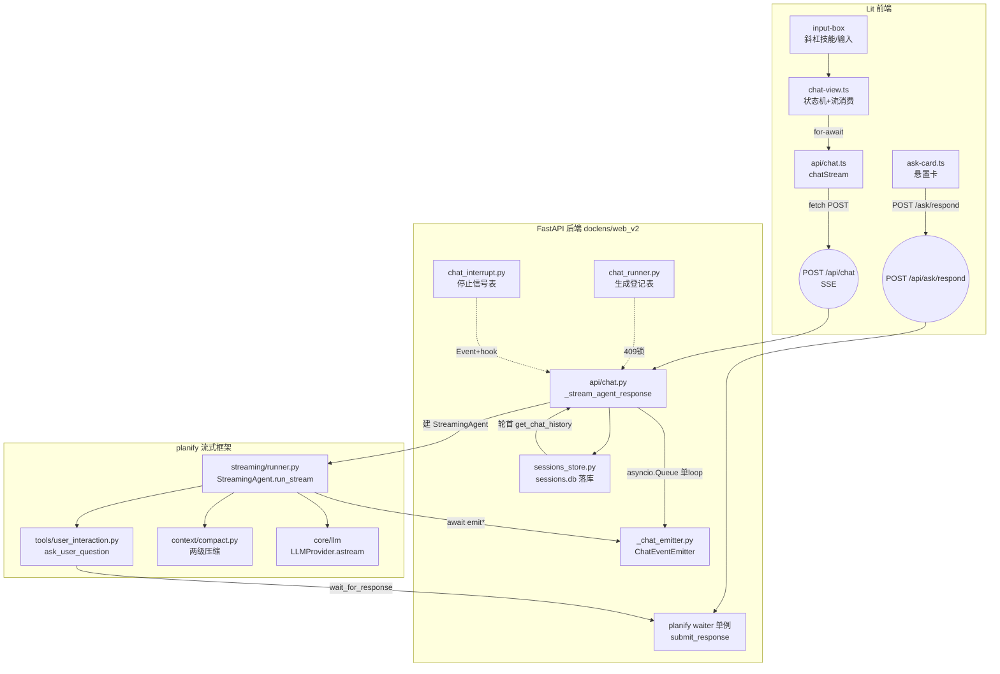
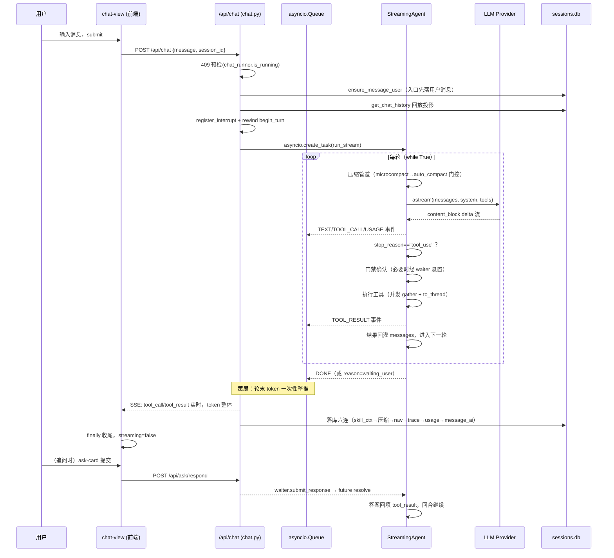
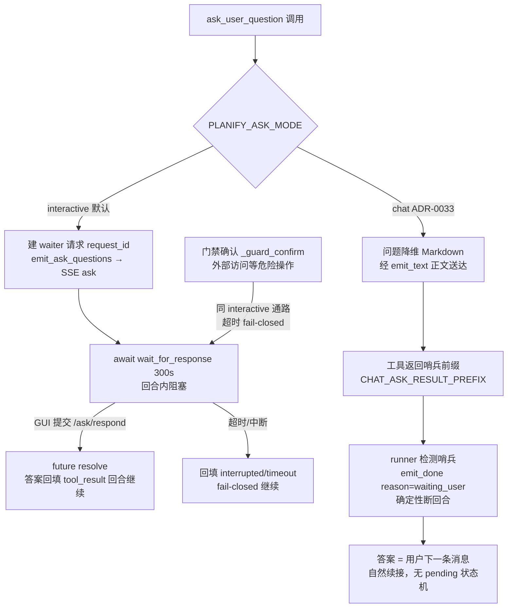
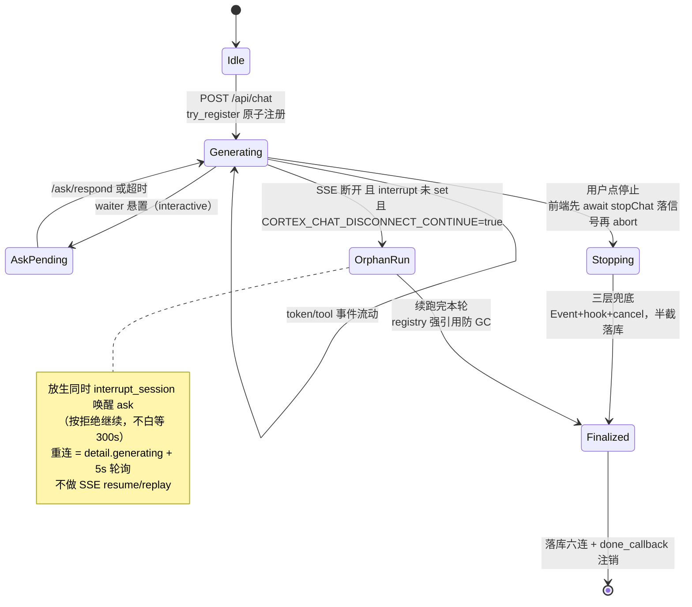
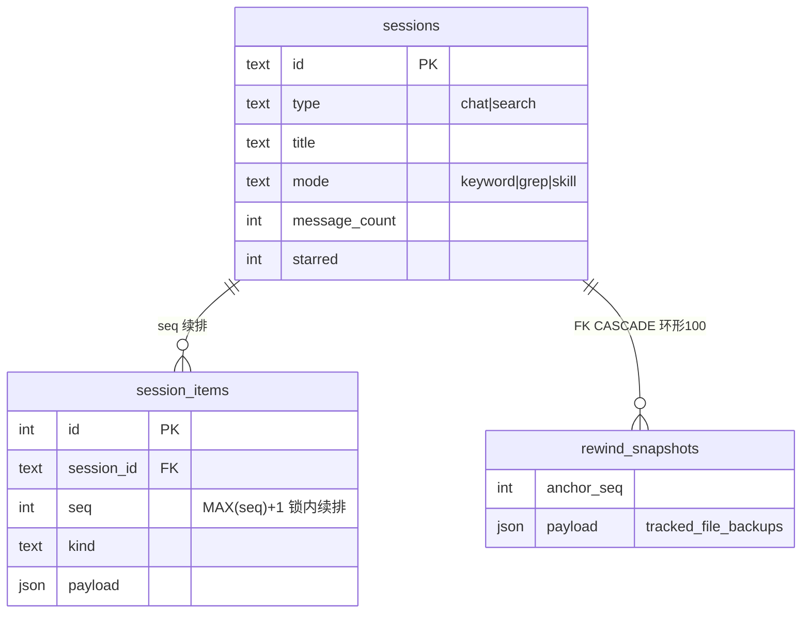

# GUI 流式端到端对话 深析

> ⚠ 构建产物：由 regen-architecture 技能（分册模式）全量重生成，勿手改。
> 生成日期：2026-10-03｜模式：feature 轨｜feature 主题词：「gui 流式端到端对话」

## 范围界定

**含**（38 个文件，约 1.5 万行，四域）：

| 域 | 文件 |
|---|---|
| 前端 chat 链 | `doclens/web_v2/frontend/src/views/chat-view.ts`、`api/chat.ts`、`api/client.ts`、`api/ask.ts`、`components/input-box.ts`、`components/ask-card.ts`、`components/md-viewer.ts`、`components/session-info-dialog.ts`、`state/types.ts` |
| 后端 SSE | `doclens/web_v2/api/chat.py`、`api/_chat_emitter.py`、`api/_chat_events.py`、`api/ask.py`、`api/sessions.py`、`chat_runner.py`、`chat_interrupt.py`、`deps.py` |
| planify 流式核心 | `planify/streaming/runner.py`、`emitter.py`、`types.py`、`waiter.py`、`tools/user_interaction.py`、`tools/registry.py`、`context/compact.py`、`core/runtime_manager.py`、`core/runtime.py`、`doclens/agent_integration.py` |
| LLM Provider + 持久层 + 测试 | `planify/core/llm/provider.py`、`types.py`、`factory.py`、`presets.py`、`anthropic_provider.py`、`openai_compat_provider.py`、`doclens/web_v2/sessions_store.py`、`tests/test_chat_disconnect.py`、`test_chat_usage_event.py`、`e2e_sse_ask.py` |

**不含**：watch SSE 流（另一链路）、搜索/索引链路、MCP、rewind_tracker 文件备份细节（仅引用）、diary、TUI/CLI 对话入口（仅作对照）。

**发现依据**：主题词「流式/SSE/chat/ask/断开/续跑」grep 全仓命中 + ADR-0028（断开续跑）、ADR-0033（对话式提问）、ADR-0026（压缩即事实，间接相关）人工归入。

## 1. 全链路总览

一次 GUI 对话横跨四层，事件下行、应答上行，单向依赖（doclens → planify，红线内）：



要点：agent 生成与 SSE 消费**同跑在 ASGI 主事件循环**（provider.astream 异步不阻塞），经 `asyncio.Queue` 桥接（`put_nowait` 同 loop 天然保序无锁）；无独立生成线程。模块边界靠 EventEmitter 协议与 UserResponseWaiter 协议维持——planify 零 doclens import（`tests/test_architecture.py` 机械守护）。

## 2. 端到端时序：一次带工具与追问的对话



## 3. 事件流协议（planify 9 类 → SSE 9 类）

### 3.1 两级事件名映射

| planify StreamEventType | SSE 事件 | 载荷 | 触发时机 |
|---|---|---|---|
| TEXT | `token` | text | **非实时**：emitter 只积累 text_parts，轮末策展完成一次性整推（`chat.py:322`，防策展重写跳变） |
| TOOL_CALL | `tool_call` | tool_use_id/name/input/is_complete | 工具调用完成时实时推 |
| TOOL_RESULT | `tool_result` | tool_use_id/name/output/is_error/duration_ms | 工具返回实时推，duration 由 emitter 计时 |
| ASK_USER（结构化） | `ask` | request_id/questions[] | ask_user_question 一等协议（interactive 模式） |
| NOTICE | `toast` | level/detail | 自动压缩等中性通知（ADR-0026），转 toast 不落库 |
| ERROR | `error` | detail | LLM 异常透传 / task 异常 |
| USAGE | `usage` | 四 token 字段 + context_window | 每次 LLM 调用后逐条推，末条=本轮峰值 |
| DONE | `done` | reason（仅异常终止如 waiting_user） | emitter 带 reason 才推；正常完成由 event_stream 兼底发空 done |
| HEARTBEAT | —（注释行 `: heartbeat`） | — | SSE 保活；HEARTBEAT 类型事件实际不上线流 ⚠ |

未知事件类型：前端 console.warn 跳过（前向兼容），后端 warning 丢弃。

### 3.2 前端消费（applyStreamEvent@chat-view.ts:54 规约）

- `token` → 末尾 assistant.content 拼接（打字机语义由整推+一次渲染实现）
- `tool_call`/`tool_result` → ToolStep 数组状态机（running→done/error）
- `ask` → `validateAskQuestions` 结构校验（防模型伪造 guard 位）→ pendingAsk 悬置卡
- `usage` → `_sessionUsage` 聚合（seq=MAX_SAFE_INTEGER 区分实测/压缩估算口径）
- `done` reason=waiting_user → toast「等待你的回复」（ADR-0033）
- `error` → 作为 token 拼入 `⚠️ detail`，流不中断

## 4. 三种交互形态（ask 的两种模式 + 门禁）



- **悬置卡**（CONTEXT.md 术语）：钉在消息列表与输入框之间固定槽位、不随流滚动；同一时刻至多一张，新提问替换旧的；guard 卡前端 122s 本地超时（后端 120s + 2s 缓冲）。
- waiter 单例是**跨线程应答回传通道**：任意线程 `submit_response` → 锁内标 consumed → 属主 loop `call_soon_threadsafe` resolve future。
- chat 模式开关 env 全局、每次工具调用时读取（热生效）；设置页「提问方式」select 可视化配置。

## 5. 断连/停止/续跑语义（ADR-0028）



关键机制：

| 机制 | 实现 | 位置 |
|---|---|---|
| 主动停止 vs 断开判据 | 停止信号到达时序：前端先 await stopChat 落信号再 abort；finally 早退判 `interrupt.is_set()` 分支 | chat.py finally / chat-view `_stop` |
| 生成锁 | `try_register` 原子注册 + done_callback 自动注销（防泄漏 409）；409 SESSION_BUSY 预检 | chat_runner.py:32 |
| interrupt 注销时机 | 随 **agent 收尾**（非 SSE finally）——续跑期 /chat/stop 仍可寻址 | chat.py `_run_and_finalize` |
| interrupt 竞态防护 | `unregister` 仅当同一 Event 才删（防「停→速重发」误删新流信号） | chat_interrupt.py |
| 恢复可见性 | detail `generating` 字段（源自 is_running）+ 前端 5s metaOnly 轮询 + 启动自动进恢复态 | sessions.py / chat-view `_startGeneratingPoll` |

**⚠ 与 ADR-0028/CONTEXT.md:159 所述不符**：ADR-0028 §3 与 CONTEXT.md 2026-09-19 条目均写「在线主动停止不落 message_ai（UI 丢弃半截既有语义）」；代码已变更——chat.py:443 注释明确 **2026-09-22 语义变更：主动停止时已生成部分也落库**（测试 test_chat_disconnect.py 用例⑤ 亦断言半截 `[策展] 半截` 落库）。以代码为准。

## 6. 轮次循环内部（StreamingAgent.run_stream，runner.py:353-654）

每轮 while True 顺序：

1. **压缩管道**（循环顶部）：usage-based token 估算一次两用——microcompact 门控（threshold×GATE_RATIO，清旧 tool_result 为 `[cleared]`，keep=10）→ 估算超 compact_threshold（=context_window×0.8，宿主传入）则 aauto_compact 整体替换并重注入头部 context/skill body，重置 round_start_index。
2. **后台通知/收件箱**：bg_manager.drain()、bus.read_inbox("lead") 以 user+assistant("Noted.") 对注入尾部。
3. **LLM 流调用**：ToolCallState 拼增量 JSON（解析失败回 `{"_parse_error": raw}`），边收边 emit；message_stop 后 emit_usage。
4. **终止判定**：stop_reason != tool_use → emit_done(summary=全文[:500])，`_cleanup_messages` 剥工具链返回（Web 丢弃返回值，历史真相在 DB）。
5. **工具执行**：门禁确认 → task≥2 并发 gather + 同步 handler to_thread → tool_result 以 user 消息块回灌。
6. **chat 哨兵检测**：任一工具输出以 CHAT_ASK_RESULT_PREFIX 开头 → emit_done(reason=waiting_user) 断回合。
7. **轮次预算三机制**：纯轮询轮不计入；连续 3 轮同参签名→死循环提醒；软阈值 max_tool_rounds 收尾提醒 + 硬阈值 force_answer_rounds→suppress_tools 强制终答（提醒以 system-reminder 消息对追加，不破坏前缀缓存）。

## 7. 持久化：落库六连与回放投影

### 7.1 落库时机与顺序（load-bearing）

流式过程中几乎不写库（唯一例外：入口 `ensure_message_user` 先落本轮用户消息——回退锚点/分组依赖）；全部写库集中在 `_run_and_finalize` 的 **finally**（断开/取消/异常都执行）：

```
upsert_skill_contexts → append_compacted/microcompact → append_raw_messages
（round_start_index 切片）→ append_chat_turn_raw（tool traces）→ append_usages
（批量单事务）→ append_message_ai + update_count_and_time
```

### 7.2 sessions.db 与 kind 体系



kind 全集（源码实证 10+）：`message_user / message_ai（展示层策展）/ message_ai_raw / raw_messages（一轮原始消息序列，LLM 回放首选）/ tool_trace（旧版兜底）/ usage / compacted（压缩边界）/ microcompact（清理 id 清单）/ rewound（回退边界）/ skill_context`。**无独立 ask kind**——ask 交互经内存 request_id + tool_result 文本回流留痕（e2e T6b 验证）。

### 7.3 回放投影（get_chat_history，~170 行）

滤死段（rewound 区间并集）→ 预扫描 microcompact id 并集 → 按 message_user 分轮 → raw_messages 优先原样回放（抑制 tool_trace 兜底）→ compacted 清空前缀再拼摘要 → microcompact 按 id 替换 `[cleared]` → skill_context 回放为 user+“Noted.” → user/user 相邻补 `(interrupted)` → 末尾剥孤儿 tool_result。目标：**回放与历史真实请求逐字节一致**（跨轮 prompt 前缀缓存的前提，ADR-0026）。

## 8. LLM Provider 层（流的源头）

- **LLMProvider 协议 5 方法**：chat/achat（非流式→LLMResponse）、stream/astream（→归一化 StreamEvent 迭代器）、count_tokens（len//4 粗估）。**⚠ 与 CLAUDE.md:265 所述不符**：CLAUDE.md 写「chat/stream/count_tokens」三方法，实际另有 achat/astream（provider.py:52,64）——异步路径是 StreamingAgent 直跑 ASGI 主 loop 的关键。
- 输入方言统一 **Anthropic 风格** messages/tools；openai_compat 在 provider 内部经 tool_translator 翻译。
- **Anthropic 后端**：SDK 事件与归一化事件同构，一对一映射；usage 挂 message_start（全量四字段）+ message_delta（output）；prompt caching 三断点（system 尾块/最后工具/最后 user 末块，每轮重打）；非流式大 max_tokens 自动降级流式聚合。
- **OpenAI 兼容后端**：`_StreamTranslator` 状态机重造 Anthropic 形态事件——tool_call 按 index+1 映射 block、finish_reason 补发 block_stop/message_delta、显式合成 message_start/message_stop、尾 chunk usage 挂 message_delta；server_tools 抛错（宁拒勿静默）。
- 归一化 StreamEvent 六事件：message_start / content_block_start / delta / content_block_stop / message_delta / message_stop（+ text_delta、input_json_delta、stop_reason、usage 等字段）。

## 9. 配置与开关

| 开关 | 命名空间 | 默认 | 作用 |
|---|---|---|---|
| `CORTEX_CHAT_DISCONNECT_CONTINUE` | doclens | true | 断开续跑 on/off（false=旧行为断开即停） |
| `PLANIFY_ASK_MODE` | planify | interactive | ask_user_question 形态（chat=对话式断回合，ADR-0033） |
| `PLANIFY_LLM_TRACE` / `PLANIFY_LLM_TRACE_DIR` | planify | 关 / {workdir}/.planify/llm_trace/ | LLM 追踪落盘（每会话一 md） |
| compact_threshold | 宿主传入 | context_window×0.8 | auto_compact 触发线 |
| max_tool_rounds / force_answer_rounds | StreamingConfig | 软/硬 | 轮次预算双阈值 |

## 10. 测试矩阵

| 文件 | 验证 |
|---|---|
| tests/test_chat_disconnect.py | ADR-0028 全景：原子注册/幂等用户消息/message_ai 形态/断开放生续跑补写/先停后断半截落库/耗尽不补写/开关回退/409 |
| tests/test_chat_usage_event.py | USAGE 事件链：默认实现包装/SSE dict/多轮逐条收集/notice→toast 不混入 |
| tests/e2e_sse_ask.py | 真实服务 E2E（非 pytest）：事件顺序/ask 闭环/ask 悬挂 stop 秒停/未知 request_id/流中 stop/详情回读 |
| 前端 tests/chat.spec.ts、ask-card.spec.ts、api-client-sse-signal.spec.ts 等 | Vitest：事件规约/悬置卡三态/SSE AbortController |

## 11. 文档-代码冲突清单

| # | 冲突 | 两侧说法 | 裁决 |
|---|---|---|---|
| 1 | 主动停止是否落 message_ai | ADR-0028 §3 + CONTEXT.md:159「不落，UI 丢弃半截」 vs chat.py:443「2026-09-22 起：停止也落库」+ test 断言半截落库 | 代码为准：**停止也落库**；文档滞后，建议补 CONTEXT.md 2026-09-22 条目 |
| 2 | chat.py 模块 docstring | docstring「前端在场时由前端写，判重防双写」（初版形态） vs 代码已统一后端单通道 | 代码为准；docstring 陈旧 |
| 3 | LLMProvider 方法数 | CLAUDE.md:265「chat/stream/count_tokens」 vs 协议实际 5 方法（含 achat/astream） | 代码为准 |
| 4 | HEARTBEAT 事件 | 事件体系「9 类」 vs SSE 线上实际以注释行保活，HEARTBEAT 类型不上线 | 代码为准：8 类数据事件 + 注释行保活 |
| 5 | SessionItem docstring | kind 注释仅 3 种 vs 实际 10+ | 代码为准 |
| 6 | guard 超时口径 | CONTEXT.md「悬置卡」未提双超时分级 vs 代码：模型提问 300s / 门禁 120s fail-closed + 前端 122s 缓冲 | 代码为准（方向一致，文档欠细） |
