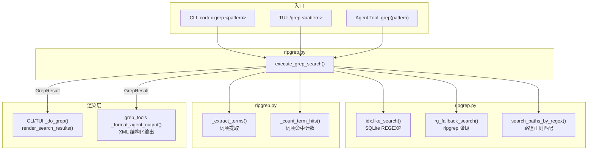
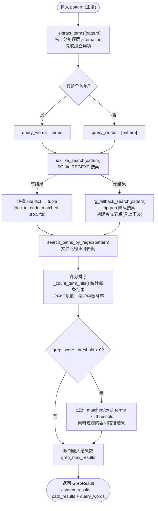
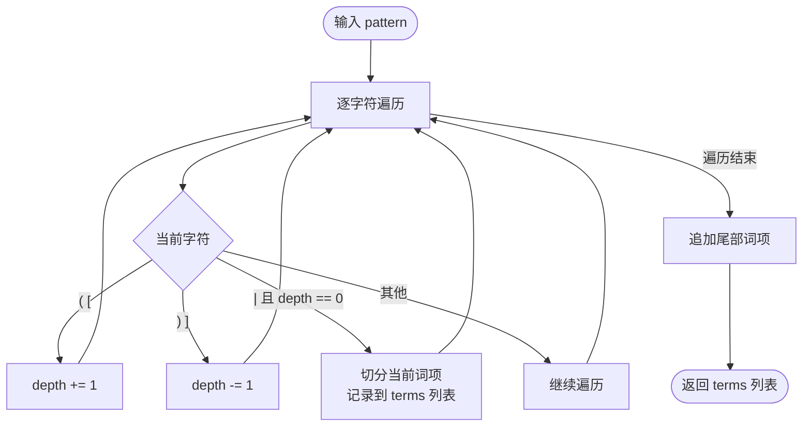
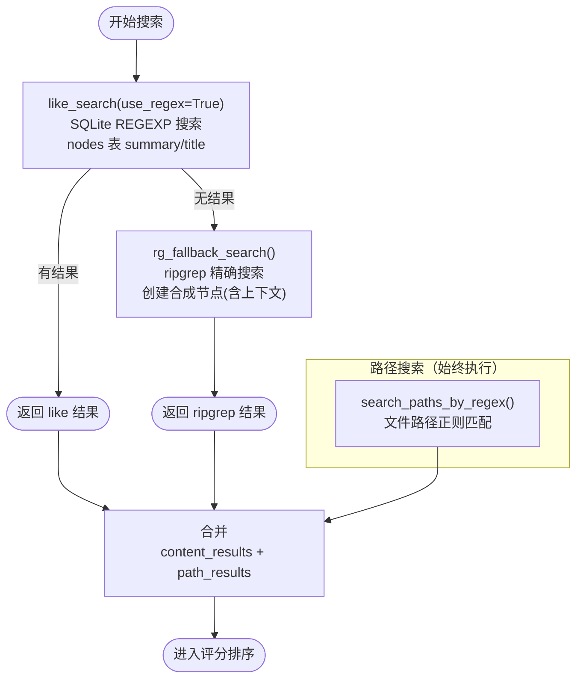
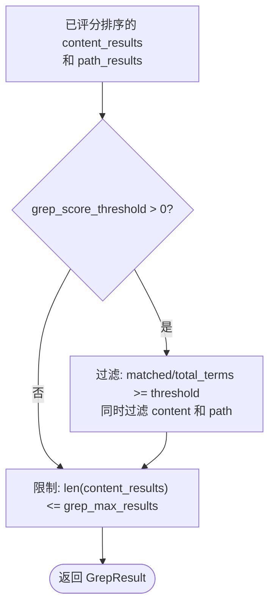
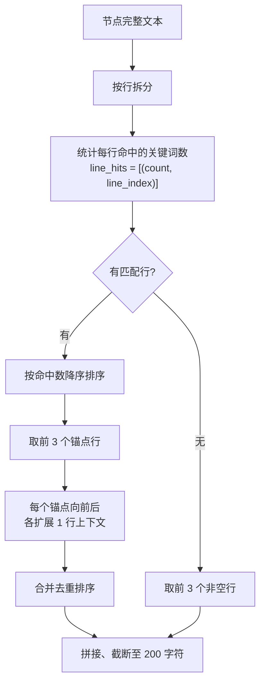

# Cortex Grep 搜索逻辑详解

---

# 第一章 grep 管道

> CLI `cortex grep <pattern>`、TUI `/grep <pattern>` 和 Agent `grep` Tool 共享同一套搜索管道，基于 `ripgrep.py` 的 `execute_grep_search()` 实现。

---

## 1.1 整体架构



---

## 1.2 搜索管道流程

`execute_grep_search()` 是核心入口，封装了完整的搜索 → 评分 → 过滤流程：



---

## 1.3 词项提取算法

`_extract_terms()` 从正则表达式中提取独立词项，用于后续评分：



**示例**：

| 输入 | 提取结果 | 说明 |
|------|----------|------|
| `"Explainable\|Next-Gen\|AI"` | `["Explainable", "Next-Gen", "AI"]` | 顶层 `|` 分割 |
| `"def\s+\w+"` | `["def\\s+\\w+"]` | 无 `|`，整体为一个词项 |
| `"foo\|bar(baz\|qux)"` | `["foo", "bar(baz\|qux)"]` | 括号内 `|` 不分割 |

---

## 1.4 搜索后端（两级降级）



**`rg_fallback_search()` 两种模式**：

| 模式 | 条件 | 行为 |
|------|------|------|
| 模式 1：匹配已有节点 | `doc_nodes_map` 非空 | 从已有节点中找匹配行号或文本 |
| 模式 2：创建合成节点 | `doc_nodes_map` 为空 | 读取文件，生成含上下文的合成节点 |

grep 管道始终使用**模式 2**（`doc_nodes_map={}`），因为 grep 场景不需要匹配已有索引节点。

---

## 1.5 评分与过滤

### 1.5.1 评分算法

评分基于**词项命中率**，与 search 管道的加权综合评分不同，更简单直接：

```
score = matched_terms / total_terms
```

- `total_terms = len(query_words)` — 提取的词项总数
- `matched_terms = _count_term_hits(text, terms)` — 结果文本中命中了多少个词项
- 每个词项用 `re.search(term, text, IGNORECASE)` 匹配

### 1.5.2 过滤策略



**配置参数**：

| 参数 | 默认值 | 作用 |
|------|--------|------|
| `grep_score_threshold` | 0.0 | 评分阈值（0.0-1.0），低于此值的结果被过滤 |
| `grep_max_results` | 50 | 内容结果最大返回条数 |

---

## 1.6 调用方对比

### TUI (`tui/app.py`)

```python
# _do_grep() 精简后 ~20 行
result = execute_grep_search(self.idx, query, self.max_results)
all_results = result.content_results + result.path_results
renderables = render_search_results(
    results=all_results, query=query,
    query_words=result.query_words,
    path_map=self.idx.path_map,
    max_results=self.max_results,
    is_ripgrep=True,
)
```

### Agent Tool (`grep_tools.py`)

```python
# _handle_grep() 精简后 ~15 行
result = execute_grep_search(idx, pattern, max_results)
output = _format_agent_output(
    content_results=result.content_results,
    path_results=result.path_results,
    path_map=idx.path_map,
    total_terms=len(result.query_words),
    query_words=result.query_words,
)
```

**差异仅在渲染层**：TUI 用 Rich Text 渲染（星级评分 + 高亮），Agent Tool 用 XML 结构化输出。搜索和评分逻辑完全一致。

---

# 第二章 Agent 输出格式

> `grep_tools.py` 的 `_format_agent_output()` 生成 XML 结构化文本，格式与 `search_kb` 的 `_format_kb_results()` 对齐。

---

## 2.1 XML 输出结构

```xml
Found 3 results in 2 files:
Use read_document tool to read full content: path=<path value>.

<result index="1" score="100%" matches="3/3">
  <path>科技/quantum_ai_report.pdf:59</path>
  <content>NSFC launched the 'Explainable Next-Gen AI' program, combining neural network quantum states</content>
</result>

<result index="2" score="33%" matches="1/3">
  <path>科技/AI伦理与治理.md</path>
  <content># AI伦理与治理：构建负责任的人工智能</content>
</result>

Paths matched: 科技/next_gen_ai.md, config/ai_settings.yaml
```

**与 search_kb 输出的对比**：

| 维度 | search_kb | grep |
|------|-----------|------|
| `<doc>` | 有（文档标题） | 无 |
| `<path>` | 有 | 有（含行号） |
| `<hierarchy>` | 有（层级路径） | 无 |
| `<content>` | 有 | 有 |
| `score` | 加权综合评分（%） | 词项命中率（%） |
| `matches` | N/M 词 | N/M 词项 |
| 路径匹配 | 无 | `Paths matched:` 附加行 |
| 字符限制 | `max_total_chars` | `MAX_TOTAL_CHARS=8000` |

---

## 2.2 内容选取算法（智能锚点）

`_select_keyword_lines()` 从节点完整文本中选取最相关的内容片段，逻辑与 TUI `render_search_result` 的锚点选择一致：



---

## 2.3 输出控制

| 参数 | 值 | 作用 |
|------|-----|------|
| `MAX_TOTAL_CHARS` | 8000 | 总输出字符上限（超出截断并提示） |
| `max_lines` | 3 | 锚点行上限 |
| `context_range` | 1 | 锚点上下文扩展行数 |
| 截断长度 | 200 | 单条 content 字符上限 |

---

# 第三章 公共模块

> `ripgrep.py` 提供搜索管道和评分基础设施，`grep_tools.py` 提供 Agent 输出格式化。

---

## 3.1 数据结构

### GrepResult

```python
@dataclass
class GrepResult:
    content_results: list[tuple[str, dict, int, int, float]]
    path_results:    list[tuple[str, dict, int, int, float]]
    query_words:     list[str]
```

tuple 格式：`(doc_id, node_dict, matched_count, proximity, fts_score)`

| 字段 | 类型 | 说明 |
|------|------|------|
| `doc_id` | str | 文档 ID |
| `node_dict` | dict | `{"title": ..., "text": ..., "line_start": ...}` |
| `matched_count` | int | 命中词项数（评分排序后更新） |
| `proximity` | int | 邻近度（grep 场景下固定为 0） |
| `fts_score` | float | FTS 分数（like_search 有值，ripgrep 为 0） |

---

## 3.2 搜索后端函数

### rg_fallback_search()

```python
def rg_fallback_search(query, path_map, doc_nodes_map, query_words,
                       context_before=6, context_after=5, use_regex=False)
    → list[tuple[str, dict, int, int, float]]
```

ripgrep 降级搜索，支持两种模式：
- `doc_nodes_map` 非空：匹配已有索引节点
- `doc_nodes_map` 为空：创建合成节点（grep 管道使用此模式）

### search_paths_by_regex()

```python
def search_paths_by_regex(regex, path_map, max_results=100)
    → list[tuple[str, dict, int, int, float]]
```

在文件路径上执行正则匹配，返回 `[路径匹配]` 标记的节点。

---

## 3.3 文件结构

```
grep 相关文件
├── cortex/
│   ├── ripgrep.py              ← 统一搜索管道（第一章）
│   │   ├── GrepResult            dataclass: content + path + query_words
│   │   ├── _extract_terms()      从正则提取词项（按 | 分割）
│   │   ├── _count_term_hits()    统计文本命中词项数
│   │   ├── execute_grep_search() 主入口：搜索→评分→过滤
│   │   ├── rg_fallback_search()  ripgrep 降级搜索
│   │   ├── search_paths_by_regex() 路径正则匹配
│   │   └── build_rg_paths()      构建搜索路径（含 shadow MD）
│   │
│   ├── grep_tools.py           ← Agent Tool 输出（第二章）
│   │   ├── GREP_TOOL             Anthropic tool schema
│   │   ├── build_grep_tools()    注册工具定义和 handler
│   │   ├── _handle_grep()        Agent handler 入口
│   │   ├── _format_agent_output() XML 格式化输出
│   │   └── _select_keyword_lines() 智能锚点内容选取
│   │
│   ├── tui/
│   │   └── app.py              ← TUI 入口
│   │       ├── _cmd_grep()       路由命令
│   │       └── _do_grep()        调用 execute_grep_search + Rich 渲染
│   │
│   ├── cortex_cli.py           ← CLI 入口
│   │   └── _cli_grep()          调用 grep_tools handler
│   │
│   ├── agent_integration.py    ← Agent 注册
│   │   └── build_grep_tools()   传入 IndexManager
│   │
│   ├── index_manager.py        ← IndexManager（持有 grep 配置）
│   │   ├── grep_score_threshold  评分阈值
│   │   └── grep_max_results      最大结果数
│   │
│   └── config.py               ← CortexConfig
│       ├── grep_score_threshold  默认 0.0
│       └── grep_max_results      默认 50
```

---

## 3.4 与 search 管道的对比

| 维度 | search 管道（scoring_pipeline.py） | grep 管道（ripgrep.py） |
|------|----------------------------------|------------------------|
| **搜索后端** | FTS5 → LIKE → ripgrep 三级降级 | REGEXP → ripgrep 两级降级 |
| **评分算法** | 加权综合（5 因子） | 词项命中率（matched/total） |
| **词项来源** | jieba 分词 | 正则 `|` 分割 |
| **路径搜索** | 无 | search_paths_by_regex() |
| **输出格式** | ScoreResult（交由渲染层） | GrepResult（交由渲染层） |
| **Agent 输出** | XML（含 doc + hierarchy） | XML（仅 path + content） |
| **输入类型** | 自然语言查询 | 正则表达式 |
