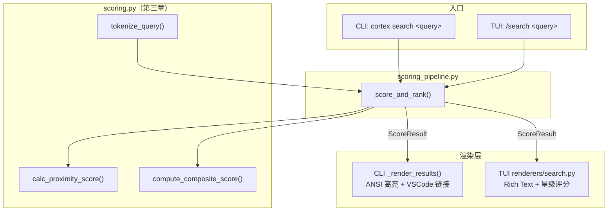
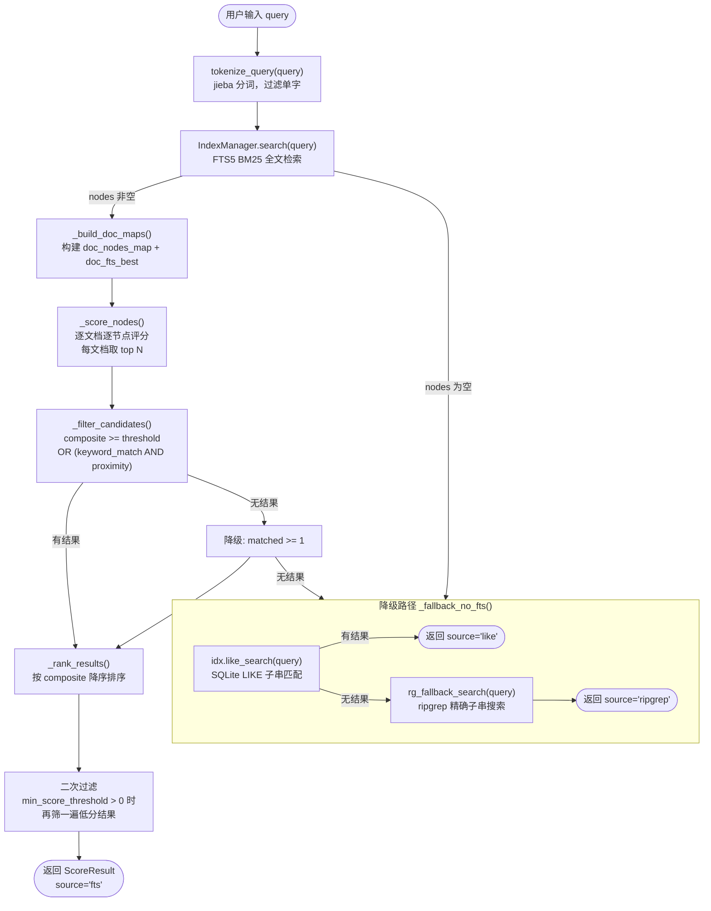
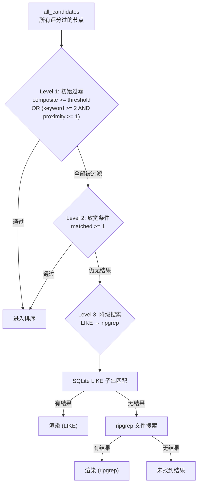
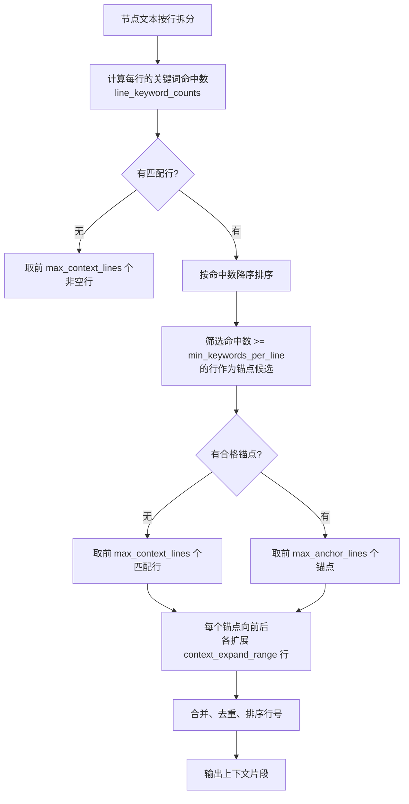
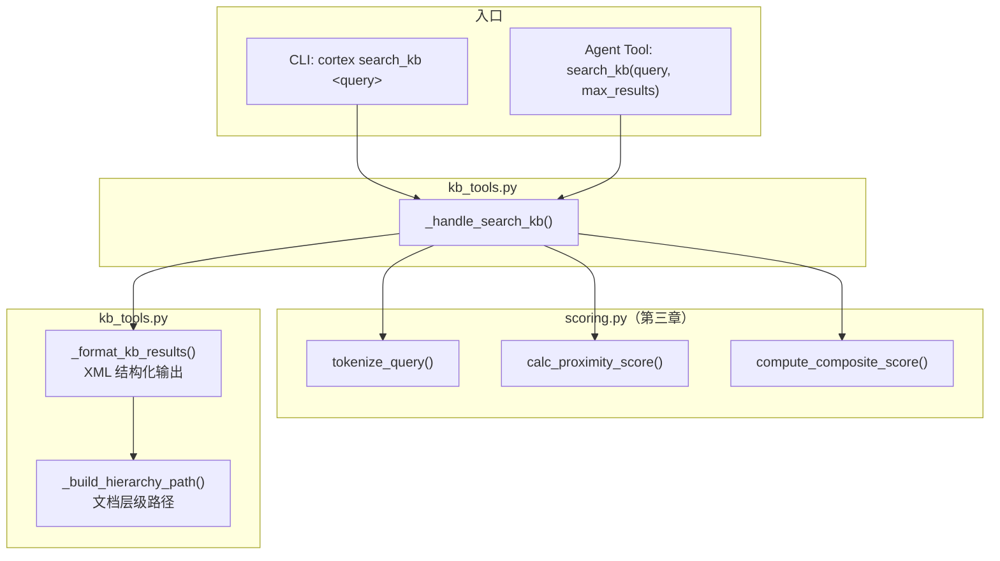
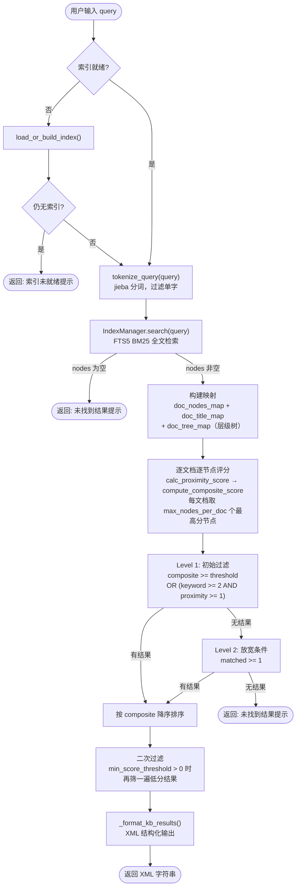
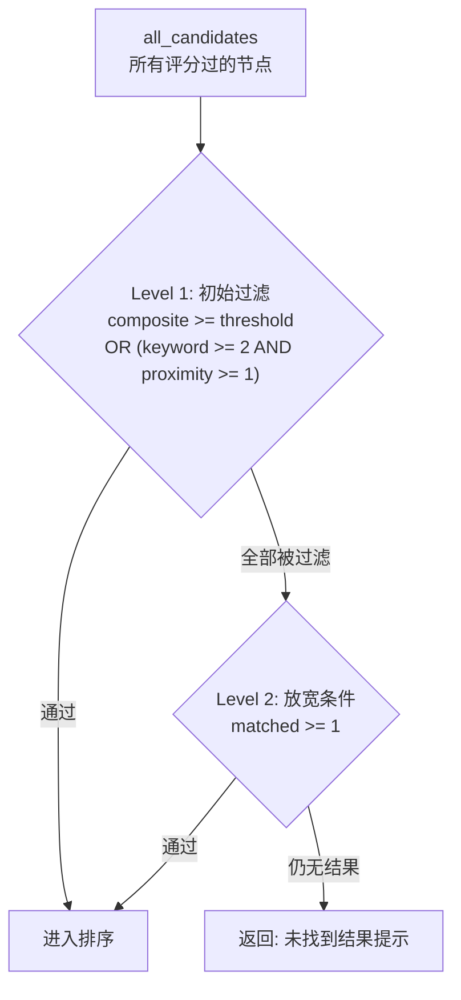
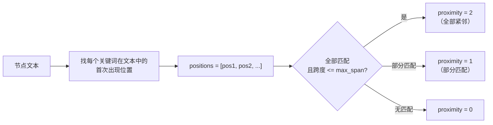

# Cortex 搜索逻辑详解

---

# 第一章 search 管道

> CLI `cortex search <query>` 和 TUI `/search <query>` 共享同一套管道，基于 `scoring_pipeline.py` 的 `score_and_rank()` 实现评分/过滤/降级逻辑。

---

## 1.1 整体架构



---

## 1.2 搜索管道流程

`score_and_rank()` 是核心入口，封装了完整的评分 → 过滤 → 降级 → 排序流程：



---

## 1.3 过滤策略（三级降级）



**关键配置参数**（`CortexConfig`）：

| 参数 | 默认值 | 作用 |
|------|--------|------|
| `min_score_threshold` | 0.0 | 综合评分阈值（初始 + 二次过滤） |
| `min_keyword_match` | 2 | 最少匹配关键词数 |
| `min_proximity_score` | 1 | 最少邻近度分数 |
| `max_nodes_per_doc` | 3 | 每文档最多返回几个节点 |

---

## 1.4 上下文选择算法（智能锚点）

搜索结果中每个节点的文本展示，使用"智能锚点"算法选择最有代表性的行：



**配置参数**：

| 参数 | 默认值 | 作用 |
|------|--------|------|
| `max_anchor_lines` | 3 | 最多选几个锚点行 |
| `context_expand_range` | 5 | 锚点向前后各扩展几行 |
| `min_keywords_per_line` | 2 | 行至少命中几个关键词才算锚点 |
| `max_context_lines` | 5 | 无匹配行时取前 N 个非空行 |

---

## 1.5 调用方对比

### CLI (`cortex_cli.py`)

```python
# format_results() 精简后 ~45 行
result = score_and_rank(nodes, docs, query, query_words, self.idx)

if result.source == "like":
    like_items = self._convert_like_to_render_items(result.like_raw, query_words)
    self._render_results(query, like_items, ..., is_like=True)
elif result.source == "ripgrep":
    self._render_results(query, result.results, ..., is_ripgrep=True)
else:
    # CLI 特有: 分数过滤日志
    self._render_results(query, result.results, ...)
```

### TUI (`tui/app.py`)

```python
# _do_search() 精简后 ~47 行
result = score_and_rank(nodes, docs, query, query_words, self.idx)

render_kwargs = dict(query=..., path_map=..., max_anchor_lines=..., ...)

if result.source == "like":
    renderables = render_search_results(results=result.like_raw, is_like=True, **render_kwargs)
elif result.source == "ripgrep":
    renderables = render_search_results(results=result.results, is_ripgrep=True, **render_kwargs)
else:
    renderables = render_search_results(results=result.results, **render_kwargs)

self.call_from_thread(self._on_search_done, renderables)
```

**差异仅在渲染层**：CLI 用 ANSI 转义码 + VSCode 超链接，TUI 用 Rich Text + 星级评分。搜索结果数据完全一致。

---

# 第二章 search_kb 管道

> CLI `cortex search_kb <query>` 和 Agent `search_kb` Tool 共享同一入口 `_handle_search_kb()`（`kb_tools.py`）。
> 评分算法与第一章相同（共用 `scoring.py`），但无降级搜索、输出为 XML 结构化文本。

---

## 2.1 整体架构



---

## 2.2 搜索管道流程

`_handle_search_kb()` 是核心入口，内联了评分 → 过滤 → 排序流程（**无降级搜索**）：



---

## 2.3 与 search 管道的差异

| 维度 | `score_and_rank()`（第一章） | `_handle_search_kb()` |
|------|--------------------------|----------------------|
| **FTS 无结果** | LIKE → ripgrep 两步降级 | **直接返回提示，无降级** |
| **评分过滤后无结果** | ripgrep 降级搜索 | **直接返回提示，无降级** |
| **代码组织** | 提取为 5 个函数 | ~80 行内联（未复用管道函数） |
| **层级路径** | 无 | `doc_tree_map` + `_build_hierarchy_path()` |
| **输出格式** | `ScoreResult` dataclass（交由渲染层） | XML 结构化字符串 |
| **字符限制** | 无硬性限制 | `max_context_chars_per_result` + `max_total_chars` |
| **评分算法** | 完全相同 | 完全相同 |

---

## 2.4 过滤策略（两级，无降级搜索）



与第一章的三级降级（§1.3）相比，`search_kb` 只有**两级过滤**，Level 2 失败后不再尝试 LIKE 或 ripgrep。

---

## 2.5 XML 输出格式

`_format_kb_results()` 生成 XML 结构化文本，每个结果包含元信息和内容摘要：

```xml
Found 3 results:
Use read_document tool to read full content: path=<path value>, section=<any section in hierarchy>.

<result index="1" score="85%" matches="3/4">
  <meta>
    <doc>量子计算入门.md</doc>
    <path>docs/quantum/量子计算入门.md</path>
    <hierarchy>量子计算入门 > 基础概念 > 量子比特</hierarchy>
  </meta>
  <content>
    量子比特（qubit）是量子计算的基本单位...
  </content>
</result>
```

**输出控制参数**：

| 参数 | 默认值 | 作用 |
|------|--------|------|
| `max_results` | 配置值 | 返回的最大结果数 |
| `max_context_chars_per_result` | 配置值 | 每个结果的内容字符上限 |
| `max_total_chars` | 配置值 | 总输出字符上限（超出截断） |

---

## 2.6 层级路径构建

`_build_hierarchy_path()` 通过 DFS 遍历文档树结构，构建节点从根到目标的标题路径：

```
文档树:                    输出:
├─ 量子计算入门            量子计算入门 > 基础概念 > 量子比特
│  ├─ 基础概念
│  │  ├─ 量子比特  ← 命中
│  │  └─ 量子门
│  └─ 进阶应用
```

---

## 2.7 调用方对比

### CLI (`cortex_cli.py`)

```python
# _cli_search_kb() 精简后
result = _handle_search_kb(idx, Path(idx.search_path), query=query)
print(result)
```

### Agent Tool (`kb_tools.py`)

```python
# build_kb_tools() 注册 handler
handlers = {
    "search_kb": lambda **kw: _handle_search_kb(idx_manager, workdir, **kw),
}

# LLM 返回 tool_use 时，handler 被调用，结果作为 tool_result 返回给 LLM
```

**差异仅在输出去向**：CLI 用 `print()` 输出到终端，Agent Tool 将字符串返回给 LLM 作为 `tool_result`。业务逻辑完全相同。

---

# 第三章 公共模块

> `scoring.py` 和 `scoring_pipeline.py` 是两个管道共用的评分核心与管道基础设施。

---

## 3.1 综合评分算法

### 3.1.1 评分因子与权重

`compute_composite_score()` 使用加权平均计算综合评分（0~1）：

| 因子 | 权重 | 计算方式 | 说明 |
|------|------|----------|------|
| `keyword_match_ratio` | 3.0 | 匹配词数 / 总词数 | 最重要：查了多少个词 |
| `file_name_match` | 2.0 | 文件名命中词数 / 总词数 | 文件名匹配说明文档相关 |
| `fts_score` | 2.0 | sigmoid(BM25分数) | FTS5 原始 BM25 相关性 |
| `title_match` | 1.5 | 标题命中词数 / 总词数 | 章节标题匹配 |
| `proximity_match` | 1.0 | proximity / 2.0 | 关键词是否紧邻出现 |

**公式**：`composite = Σ(weight × factor_value) / Σ(weight)`

### 3.1.2 邻近度评分 `calc_proximity_score()`



- `max_span` 默认 20 字符，控制"紧邻"的判定范围
- 返回 `(matched_count, proximity)`，供综合评分使用

---

## 3.2 文件结构

```
搜索相关文件
├── cortex/
│   ├── scoring.py             ← 纯计算模块（第三章 §3.1）
│   │   ├── tokenize_query()      jieba 分词，过滤单字
│   │   ├── calc_proximity_score() 关键词邻近度
│   │   └── compute_composite_score() 综合评分（加权平均）
│   │
│   ├── scoring_pipeline.py    ← search 公共管道（第一章）
│   │   ├── ScoreResult          dataclass: results + source + like_raw
│   │   ├── score_and_rank()     主入口：评分→过滤→降级→排序
│   │   ├── _build_doc_maps()    构建 doc_nodes_map + doc_fts_best
│   │   ├── _score_nodes()       逐文档评分，每文档取 top N
│   │   ├── _filter_candidates() 初始过滤
│   │   ├── _rank_results()      排序
│   │   └── _fallback_no_fts()   降级: LIKE → ripgrep
│   │
│   ├── kb_tools.py            ← search_kb 管道（第二章）
│   │   ├── _handle_search_kb()  主入口：评分→过滤→排序（无降级）
│   │   ├── _format_kb_results() XML 格式化输出
│   │   └── _build_hierarchy_path() 文档层级路径
│   │
│   ├── cortex_cli.py          ← CLI 入口
│   ├── tui/
│   │   ├── app.py             ← TUI 入口
│   │   └── renderers/
│   │       └── search.py      ← TUI 渲染器（Rich Text）
│   │
│   ├── index_manager.py       ← IndexManager（封装 TreeSearch）
│   ├── config.py              ← CortexConfig（所有配置参数）
│   └── ripgrep.py             ← ripgrep 降级搜索
```
