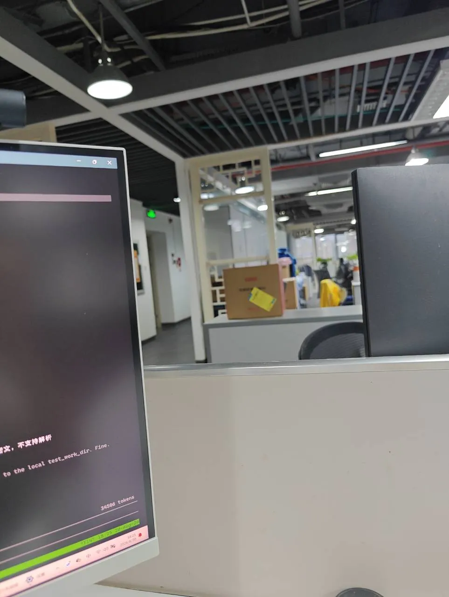

# 2026 日记

## 2026-08-20 星期四 📍广州

> ⛈️雷阵雨，25-33℃ (广州市) 静风 <3级

- 15:51 第一条记录
- 17:35 
- 17:48 
- 17:50 
- 17:50 
- 18:25  办公室工位上，一台显示器显示着深色背景的代码或终端界面，屏幕显示约34506 tokens的统计信息；隔板后方是开放式的办公区，可见裸露的天花板管道、吊灯和几名正在工作的同事，氛围安静而专注。

