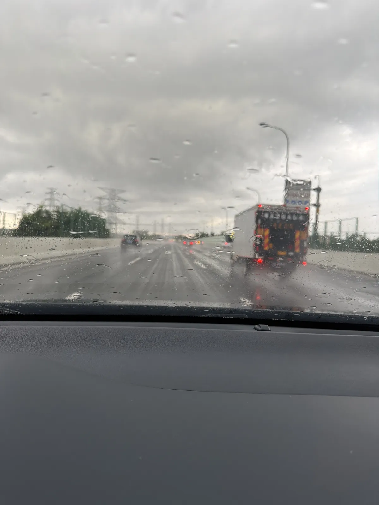
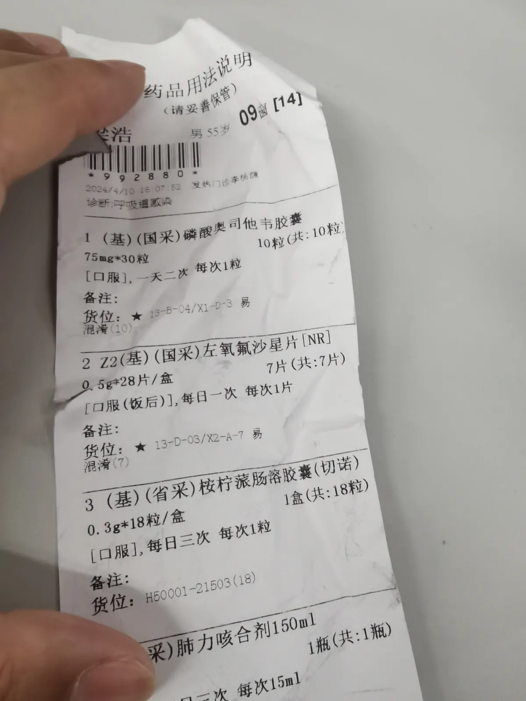
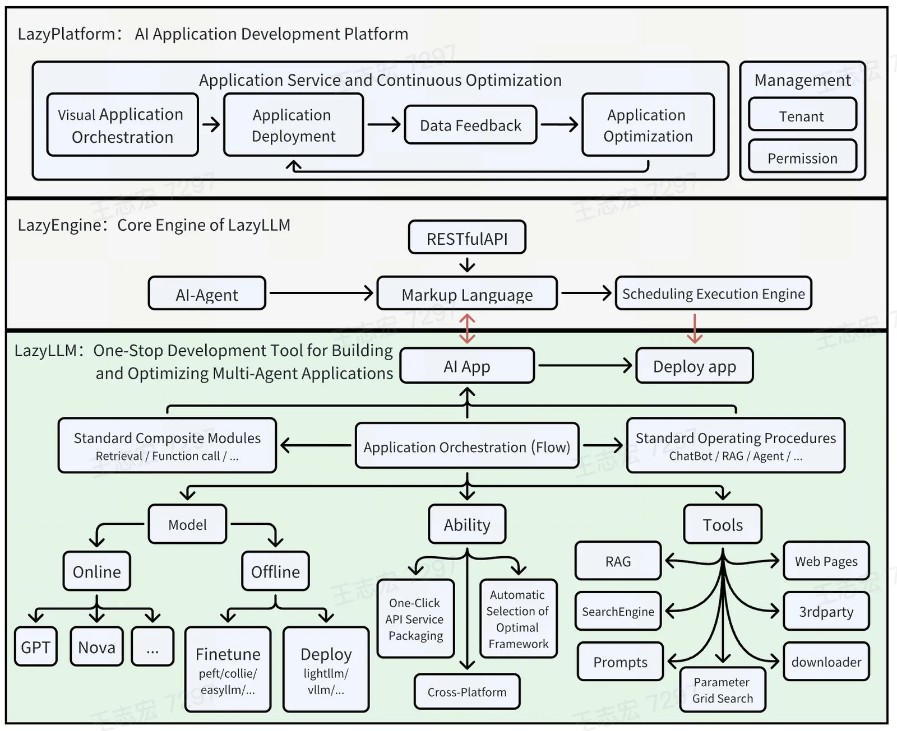

# 2026 日记

## 2026-08-04 星期二 📍广州

> 🌧️中雨，24-28℃ (珠海市) 东南风 3~4级

1. 08:16 照片：

2. 11:30 照片：

3. 12:00 上午交了2000块钱预付费，现在一共是4000块钱给医院的预付费。妈妈体温正常。医生怀疑是上消化道出血的问题。

4. 17:11 开车回广州

5. 18:14 照片：

6. 19:49 照片：

## 2026-08-05 星期三 📍广州

> ⛅多云，25-34℃ (广州市) 静风 <3级

1. 09:26 今天恢复上班，妈妈让阿姨视频我，说想回家

## 2026-08-09 星期日 📍广州

> ☀️晴，27-37℃ (广州市) 北风 3~4级

1. 20:31  一只手将一张皱巴巴的药品用法说明单举在白色背景前，上面印有诊断为"呼吸道感染"的中老年男性处方，包含磷酸奥司他韦胶囊、左氧氟沙星片等四种药物的服用说明。

## 2026-08-10 星期一 📍广州

1. 09:32 

    这张照片展示了一个名为LazyPlatform的AI应用开发平台架构图，包含LazyEngine核心引擎和LazyLLM一站式开发工具，用于构建和优化多智能体应用。图中详细描绘了从视觉应用编排、部署、数据反馈到应用优化的全流程，以及AI代理、标记语言、调度执行引擎等组件之间的关系。

